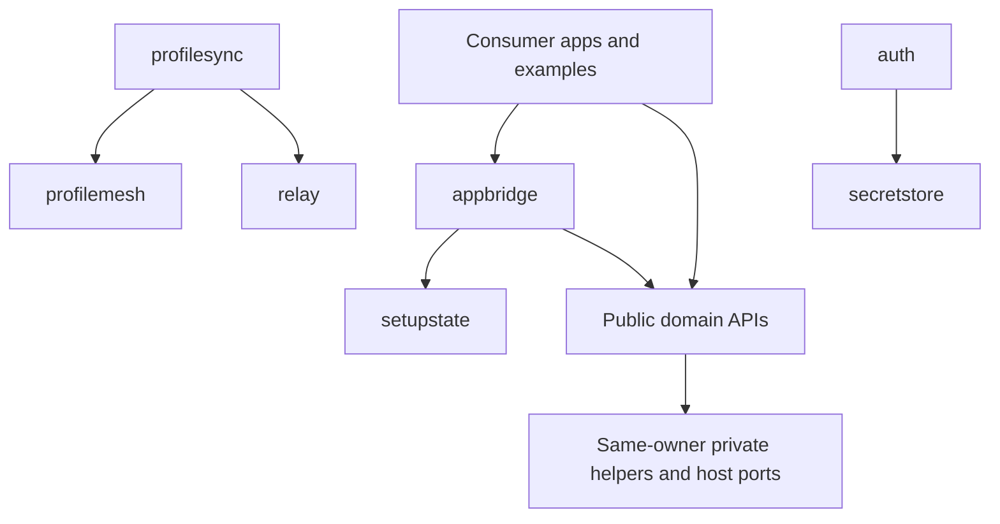

# Core modules and object ownership

This is the architecture of the September 2026 compatibility-preserving
reorganization. Core remains one Go module with eleven public domain packages.
Applications continue to import `github.com/AegisAgentAscalon/aegis-core/pkg/...`.

In Go, the useful equivalent of a class is a struct with methods. Interfaces
describe collaborators, and composition connects them. Core uses these existing
language features; it does not need an inheritance hierarchy, a universal service
manager, or a dependency injection framework. See the Go guidance on
[composition](https://go.dev/doc/effective_go#embedding) and
[module layout](https://go.dev/doc/modules/layout).

## Ownership map

| Domain package | Object or function that owns the work | Collaborators and limits |
| --- | --- | --- |
| `auth` | `Service`: OAuth setup, sign-in, sign-out and safe account status | Private store owns file/protected records; host supplies `secretstore.Store` with revision support for strict sessions. |
| `identitygate` | `Service`: current-operator assurance and verification state | Explicit verification provider, clock and audit sink; focused private engine under `internal/identitygate`. |
| `devicelink` | `Service`: device identity, trusted peers, proof and advertised resources | Discovery and transport providers; private registry codecs retain key material only in the intended storage/backup representations. |
| `profilemesh` | `Service`: profile, device and resource metadata | Private persistence and snapshot validation; no payload storage or automatic conflict decisions. |
| `profilesync` | `SyncManager`: metadata exchange and proposal classification | Store, transport and trust interfaces; `LocalMetadataStore`, `FileObjectProvider`, `MemoryMetadataStore`, and `RelaySyncTransport` are separate concrete adapters. |
| `updates` | `Service`: selection, download, verification, staging and lifecycle records | Source/provider policy, private persistence and transfer helpers; the consumer owns installation and external action results. |
| `relay` | `HTTPRelayClient`, HTTP handler, and `LocalDevProvider` | Opaque message transport with explicit authorization; host owns deployment and credentials. |
| `secretstore` | `Store` and `VersionedStore` contracts | Host owns platform protection; `internal/secretstore.MemoryStore` is a development/test adapter. |
| `setupstate` | `BuildOverview`: read-only capability aggregation | Snapshot of caller-owned status providers; no persistent service state is needed. |
| `appbridge` | `Bridge`: application-facing composition and safe projections | Uses public domain APIs; domain services retain their state and operations. |
| `securityposture` | Value types and pure classification/redaction helpers | Shared presentation vocabulary; no authority or mutable service registry. |

The migrated public `Service` values hold a pointer to private service state.
Copies continue to share the same owner and lock, preserving their prior value
semantics without retaining forwarding methods or duplicate DTOs.

The service owns its existing synchronization and lifecycle. Splitting its
methods across files does not create multiple state owners or change lock
boundaries. Interfaces belong at real storage, transport, clock or host-provider
boundaries. A pure helper does not need a class or interface merely for symmetry.

## Source organization

Public contract types and their implementation now live together in Auth,
Device Link, Profile Mesh, Setup State and Updates. Their duplicate `internal/`
contract trees and forwarding conversions have been removed. Unexported fields,
types and functions remain private even inside a public package.

Each domain separates contracts, state-owning service methods, validation,
external I/O and storage as appropriate. Large AppBridge, ProfileSync and Relay
files have been partitioned by responsibility without changing their declaration
bodies. Auth separates sign-in orchestration, OAuth HTTP work, session CAS,
legacy migration and file I/O. Device Link, Profile Mesh and Updates follow the
same organization around their own responsibilities.

W11 gives Auth a shared operation generation and cancellable host I/O. Its mutex
is not held across HTTP or protected-store callbacks. Strict storage contention
fails promptly; sign-out invalidates pending work before cleanup and reports an
incomplete result when a callback still owns storage. See the
[W11 record](audits/2026-09-12-w11-auth-operations.md) for retry, revision ownership
and separately constructed service limits.

W10 makes Profile Mesh's remaining boundaries explicit: public domain models in
`types.go`, configuration and shared syntax in `config.go`, schema-specific
snapshot encoding in `snapshot_codec.go`, and private registry envelopes in
`store.go`. Sync DTOs stay in `sync_contracts.go`; their pure validation is in
`sync_validation.go`, independent of service and storage operations. See the
[W10 record](audits/2026-09-11-w10-profilemesh.md) for compatibility limits.

Identity Gate already has a focused private state machine and mostly aliases
its contract types. Its private engine remains deliberate: changing the type
identity and engine at the same time as its open correctness repairs would add
unnecessary migration risk. Secret Store's contract/development-adapter split is
also intentional. Examples remain independent consumer programs under
`examples/`; CI stays under `.github/workflows/`; tests live beside the owner
they exercise. There is no new shared `models`, `utils`, or generic manager package.

## Dependency direction

This is the principal ownership direction, not an exhaustive import graph.
No domain imports AppBridge. Consumers import public packages only. Private
storage helpers cannot call back into a presentation layer. Core's packages
remain independently understandable within one versioned module.

## Compatibility and formats

The reorganization preserves public import paths, exported contracts and
methods. An existing call through `auth.Service` or `updates.Service` continues
to use the same package and method. Consumers do not need a source migration for
the new file layout.

Ordinary duplicate DTOs are consolidated, but intentionally different views
remain distinct. Device identity/trust public JSON continues to omit keys;
registry and backup codecs retain their established representations. Updates
keeps private source/policy provenance and storage records separate from public
results. Auth tokens, pending sessions and profile records remain private.
Snapshot copies, nil/empty behavior, error sentinels, signing payloads and legacy
readers must survive consolidation. Public fields are not substitutes for disk
records simply because their names look similar.

## Remaining engineering work

This pass changes ownership and organization. It does not close the 22 reproduced
[correctness findings from the September audit](audits/2026-09-11-module-reorganization.md)
or establish production readiness.
The user requested the structural pass before the audit's originally proposed
bug-fix sequence; those repair gates remain open. The next changes should address
the verified failures in bounded, separately tested patches: Identity Gate expiry
and authority propagation, manifest/artifact binding, exchange delivery loss,
storage identity collisions, then the remaining P2 cases.

Shared persistence mechanics and narrower lock scopes remain follow-on design
work. Extract them only with failure, migration, concurrency and cancellation
tests that justify the abstraction. Do not erase meaningful security regression
tests to meet a line-count target. Fewer DTOs reduce maintenance; file movement
alone does not prove faster execution or smaller binaries.
