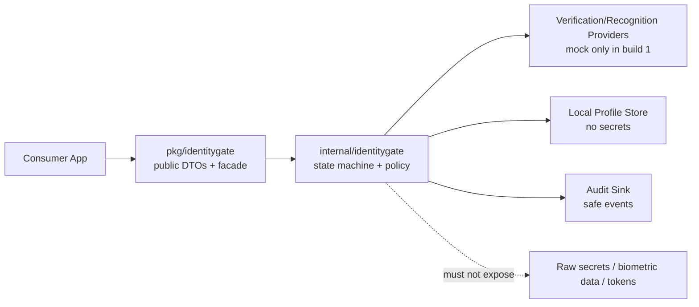
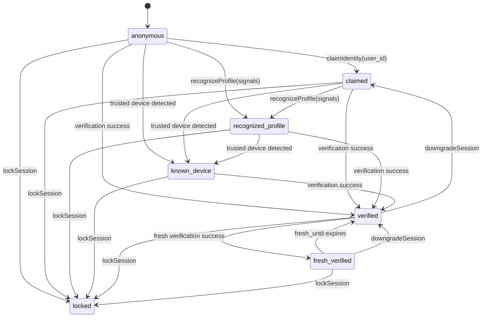
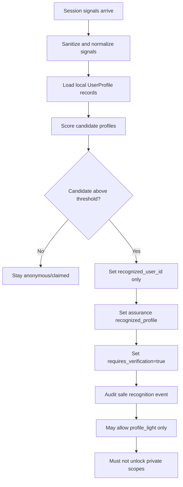
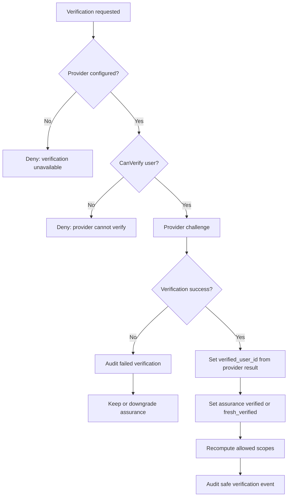
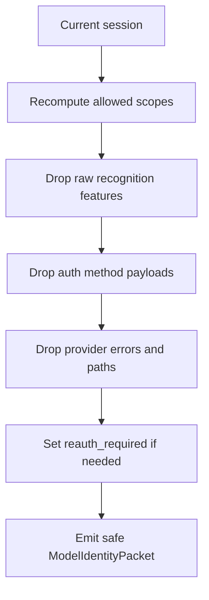
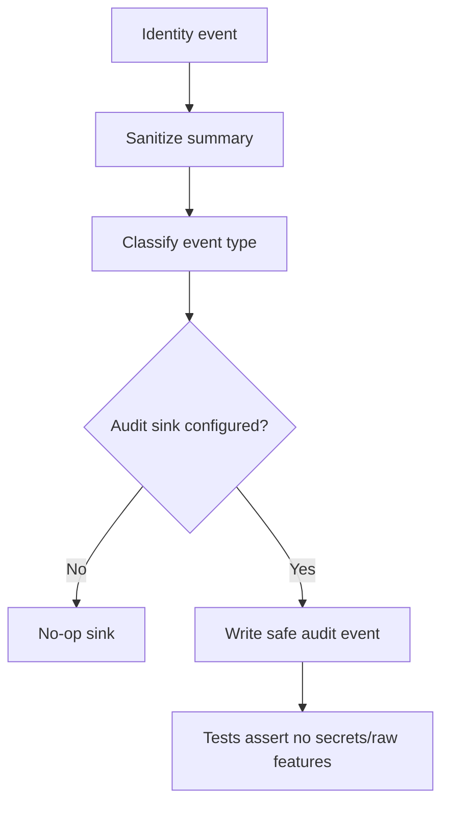

# Aegis Core Identity Gate Build Plan

Status: planning artifact / pre-implementation review
Target repo: `AegisAgentAscalon/Aegis-Core`
Target module: `github.com/AegisAgentAscalon/aegis-core`
Build slice: Identity Gate foundation only

## 0. Executive Summary

This build adds the first Aegis Core Identity Gate foundation as a small, isolated, testable Go package. It introduces identity assurance states, local user profile records, profile recognition contracts, mock verification, scope gating, safe model identity packets, audit-friendly events, and tests.

The core security law is non-negotiable:

```text
Recognition is not verification.
Similarity is not authentication.
Only Aegis Core verification may unlock private scopes.
```

The first build must not implement real biometrics, real passkeys, real hardware keys, vault encryption, VargBot integration, Nexus harness integration, release signing, or app-specific behavior.

## 1. Existing Repo Fit

Aegis Core is already shaped as a Go library with public packages under `pkg/` and private implementation under `internal/`. The Identity Gate should follow that existing doctrine:

```text
consumer app -> pkg/* public contracts -> internal/* implementation where needed
```

Recommended package addition:

```text
pkg/identitygate/identitygate.go          Public DTOs, interfaces, service facade
internal/identitygate/types.go           Internal DTOs/enums/errors
internal/identitygate/service.go         Session state machine + orchestration
internal/identitygate/scopes.go          Scope policy and sensitivity gates
internal/identitygate/profiles.go        Local user profile records + in-memory store
internal/identitygate/recognizer.go      Recognition contracts + default/mock recognizer
internal/identitygate/verification.go    Verification provider contracts + mock provider
internal/identitygate/model_packet.go    Safe model identity packet generation
internal/identitygate/audit.go           Audit event DTOs + sink interface + memory sink
internal/identitygate/sanitize.go        Redaction/safe-string helpers
internal/identitygate/clock.go           Clock interface for deterministic tests
internal/identitygate/*_test.go          Security and behavior tests
examples/identity-gate-smoke/main.go     Public API consumer smoke example
```

Optional later docs after implementation:

```text
docs/IDENTITY_GATE.md
docs/SECURITY_IDENTITY_GATE.md
```

## 2. Build Boundary

### In Scope

- Identity assurance level vocabulary.
- Local user profile records.
- Recognition result contracts.
- Verification provider interface.
- Mock verification provider only.
- Scope model and policy checks.
- Identity session lifecycle.
- Fresh-verification TTL behavior.
- Safe model identity packet generation.
- Audit-friendly event records.
- Tests proving recognition never equals verification.

### Explicit Non-Goals

- Real biometric providers.
- Real passkeys.
- Hardware security key implementation.
- Vault encryption.
- VargBot integration.
- Aegis Nexus harness integration.
- Release signing.
- App-specific behavior.
- Cloud identity authority.
- Storing raw biometric data.
- Storing secrets, tokens, private keys, OAuth tokens, vault keys, or raw provider payloads.

## 3. Security Invariants

Every implementation decision must preserve these invariants:

1. `recognized_user_id` must never be copied into `verified_user_id`.
2. A high recognition confidence must never raise assurance to `verified` or `fresh_verified`.
3. Private scopes require verification by policy.
4. Sensitive scopes require fresh verification by policy.
5. A known device is not a verified user.
6. A locked session denies all private and sensitive scopes.
7. Model identity packets must not expose raw recognition features, secrets, provider payloads, local paths, raw errors, or hidden identifiers beyond the safe fields.
8. Recognition features are personalization hints only.
9. Mock providers are testing tools, not security authorities.
10. Policy must default closed when a scope, assurance level, provider, or session state is unknown.

## 4. Identity Concepts

| Concept | Meaning | May unlock private scopes? |
| --- | --- | --- |
| Claimed identity | User says they are a known local user. | No |
| Recognized profile | Signals resemble a known local profile. | No |
| Known device | Device/session is familiar. | Limited only; never full private access alone |
| Verified identity | Verification provider confirms the user. | Yes, by policy |
| Fresh verified identity | Recent strong verification for sensitive actions. | Yes, including sensitive scopes |
| Locked session | Session is restricted due to failure, suspicious state, or policy lock. | No |

## 5. Assurance Levels

```go
type AssuranceLevel string

const (
    AssuranceAnonymous         AssuranceLevel = "anonymous"
    AssuranceClaimed           AssuranceLevel = "claimed"
    AssuranceRecognizedProfile AssuranceLevel = "recognized_profile"
    AssuranceKnownDevice       AssuranceLevel = "known_device"
    AssuranceVerified          AssuranceLevel = "verified"
    AssuranceFreshVerified     AssuranceLevel = "fresh_verified"
    AssuranceLocked            AssuranceLevel = "locked"
)
```

### Level Transition Rules

| From | Event | To | Notes |
| --- | --- | --- | --- |
| anonymous | claimIdentity | claimed | No private scopes. |
| anonymous/claimed | recognizeProfile | recognized_profile | Recognition only. |
| anonymous/claimed/recognized_profile | mark known device | known_device | Limited only. |
| any non-locked | requestVerification success | verified | Provider required. |
| verified | requestFreshVerification success | fresh_verified | Provider required; fresh TTL set. |
| fresh_verified | fresh TTL expires | verified | Keep verified if session still valid. |
| any | downgradeSession | lower assurance | Must clear scopes as needed. |
| any | lockSession | locked | Private/sensitive scopes denied. |

## 6. Scope Model

Initial scopes:

```go
type Scope string

const (
    ScopePublic             Scope = "public"
    ScopeProfileLight       Scope = "profile_light"
    ScopeUserPrivateMemory  Scope = "user_private_memory"
    ScopeAgentIdentityVault Scope = "agent_identity_vault"
    ScopeProjectPrivate     Scope = "project_private"
    ScopeSecurityAdmin      Scope = "security_admin"
    ScopeModelForge         Scope = "model_forge"
    ScopeTrainingLineage    Scope = "training_lineage"
    ScopeVaultExport        Scope = "vault_export"
)
```

### Scope Classification

| Scope | Minimum assurance | Fresh required? | Notes |
| --- | --- | --- | --- |
| `public` | anonymous | No | Always available unless session is explicitly locked and caller chooses strict deny-all. |
| `profile_light` | recognized_profile or claimed | No | Light personalization only. No private memory. |
| `user_private_memory` | verified | No by default | Sensitive reads may later require fresh verification. |
| `agent_identity_vault` | fresh_verified | Yes | Treat as sensitive from day one. |
| `project_private` | verified | No by default | Fresh may be required per caller policy later. |
| `security_admin` | fresh_verified | Yes | Security settings are sensitive. |
| `model_forge` | fresh_verified | Yes | Prevent training/config sabotage. |
| `training_lineage` | fresh_verified | Yes | Private lineage exposure risk. |
| `vault_export` | fresh_verified | Yes | Highest-risk export/destructive-adjacent scope. |

Default behavior: unknown scopes deny.

## 7. Data Contracts

### UserProfile

```go
type UserProfile struct {
    UserID                         string            `json:"user_id"`
    DisplayName                    string            `json:"display_name"`
    ProfileStatus                  ProfileStatus     `json:"profile_status"`
    ProfileCreatedAt               time.Time         `json:"profile_created_at"`
    ProfileUpdatedAt               time.Time         `json:"profile_updated_at"`
    TrustedDevices                 []TrustedDevice   `json:"trusted_devices,omitempty"`
    PreferredLocalSettings         map[string]string `json:"preferred_local_settings,omitempty"`
    NonSensitivePersonalizationNotes []string        `json:"non_sensitive_personalization_notes,omitempty"`
    RecognitionFeatures            RecognitionFeatures `json:"recognition_features,omitempty"`
    VerificationRequirements       VerificationRequirements `json:"verification_requirements"`
}
```

Recognition features may include writing-style summaries, common topics, interaction preferences, local aliases, and device/session history. They must not include raw secrets, passwords, private keys, biometric data, OAuth tokens, vault keys, or raw biometric templates.

### IdentitySession

```go
type IdentitySession struct {
    SessionID             string         `json:"session_id"`
    ClaimedUserID          string         `json:"claimed_user_id,omitempty"`
    RecognizedUserID       string         `json:"recognized_user_id,omitempty"`
    VerifiedUserID         string         `json:"verified_user_id,omitempty"`
    AssuranceLevel         AssuranceLevel `json:"assurance_level"`
    RecognitionConfidence  float64        `json:"recognition_confidence,omitempty"`
    TrustedDevice          bool           `json:"trusted_device"`
    AuthMethods            []AuthMethod   `json:"auth_methods,omitempty"`
    IssuedAt               time.Time      `json:"issued_at"`
    ExpiresAt              time.Time      `json:"expires_at"`
    FreshUntil             time.Time      `json:"fresh_until,omitempty"`
    AllowedScopes          []Scope        `json:"allowed_scopes"`
    LockReason             string         `json:"lock_reason,omitempty"`
}
```

Rule: `recognized_user_id` does not equal `verified_user_id` by assignment. They may hold the same string only after independent verification confirms that user; the implementation must never use recognition as the source of verified identity.

### RecognitionResult

```go
type RecognitionResult struct {
    CandidateUserID       string   `json:"candidate_user_id,omitempty"`
    Confidence            float64  `json:"confidence"`
    MatchedSignals         []string `json:"matched_signals,omitempty"`
    RiskFlags              []string `json:"risk_flags,omitempty"`
    RequiresVerification   bool     `json:"requires_verification"`
    Explanation            string   `json:"explanation,omitempty"`
}
```

`MatchedSignals` and `Explanation` must be safe summaries. No raw features.

### ModelIdentityPacket

```go
type ModelIdentityPacket struct {
    AssuranceLevel        AssuranceLevel `json:"assurance_level"`
    VerifiedUserID        string         `json:"verified_user_id,omitempty"`
    RecognizedUserID      string         `json:"recognized_user_id,omitempty"`
    AllowedScopes         []Scope        `json:"allowed_scopes"`
    ReauthRequired        bool           `json:"reauth_required"`
    IdentityPolicySummary string         `json:"identity_policy_summary"`
}
```

The model receives safe authorization context, not authentication machinery and not raw recognition features.

## 8. Interfaces

### IdentityVerificationProvider

```go
type IdentityVerificationProvider interface {
    CanVerify(ctx context.Context, userID string) bool
    RequestVerification(ctx context.Context, userID string, reason string) (VerificationResult, error)
    RequestFreshVerification(ctx context.Context, userID string, reason string) (VerificationResult, error)
    ProviderName() string
}
```

Initial implementation: `MockVerificationProvider` only.

### UserProfileRecognizer

```go
type UserProfileRecognizer interface {
    IdentifyCandidateProfiles(ctx context.Context, signals SessionSignals, profiles []UserProfile) ([]RecognitionResult, error)
    ScoreProfileMatch(ctx context.Context, profile UserProfile, signals SessionSignals) (RecognitionResult, error)
    ExplainRecognitionSignals(ctx context.Context, profile UserProfile, signals SessionSignals) (string, error)
}
```

### IdentityGateService

```go
type IdentityGateService interface {
    GetCurrentSession(ctx context.Context) (IdentitySession, error)
    ClaimIdentity(ctx context.Context, userID string) (IdentitySession, error)
    RecognizeProfile(ctx context.Context, signals SessionSignals) (RecognitionResult, IdentitySession, error)
    RequestVerification(ctx context.Context, userID string, reason string) (IdentitySession, error)
    RequestFreshVerification(ctx context.Context, userID string, reason string) (IdentitySession, error)
    CanAccessScope(ctx context.Context, scope Scope) (bool, error)
    RequireScope(ctx context.Context, scope Scope, reason string) error
    LockSession(ctx context.Context, reason string) (IdentitySession, error)
    DowngradeSession(ctx context.Context, reason string) (IdentitySession, error)
    CreateModelIdentityPacket(ctx context.Context) (ModelIdentityPacket, error)
}
```

## 9. Architecture Flowcharts

### 9.1 Module Boundary



### 9.2 Session Lifecycle



### 9.3 Recognition Flow



### 9.4 Verification Flow



### 9.5 Scope Gate Flow

```mermaid
flowchart TD
    A[RequireScope(scope)] --> B{Session locked?}
    B -- Yes --> DENY[Deny]
    B -- No --> C{Known scope?}
    C -- No --> DENY
    C -- Yes --> D{Scope public/profile_light?}
    D -- Yes --> E[Allow if minimum assurance met]
    D -- No --> F{Private scope?}
    F -- Yes --> G{Verified or fresh_verified?}
    G -- No --> DENY
    G -- Yes --> H{Fresh required?}
    H -- No --> ALLOW[Allow]
    H -- Yes --> I{FreshUntil valid?}
    I -- Yes --> ALLOW
    I -- No --> REAUTH[Deny with reauth_required]
```

### 9.6 Model Identity Packet Flow



### 9.7 Audit Flow



## 10. Roadmap

### Pass 0 — Preflight and Repo Alignment

Deliverables:

- Confirm module path remains lowercase.
- Add `docs/plans/IDENTITY_GATE_BUILD_PLAN.md`.
- Confirm no existing package takes identity gate ownership.
- Decide whether `setupstate` gets a new `identity_gate` capability in this build or a follow-up.

Recommended decision: add the package first; add setup aggregation only if it stays read-only and does not trigger identity operations.

### Pass 1 — Public Contracts

Deliverables:

- `pkg/identitygate/identitygate.go`
- Public enums: `AssuranceLevel`, `Scope`, `ProfileStatus`, `AuthMethod`, event kinds.
- Public DTOs: `UserProfile`, `IdentitySession`, `RecognitionResult`, `VerificationResult`, `ModelIdentityPacket`, `AuditEvent`, `SessionSignals`.
- Public interfaces and service facade.

Rules:

- DTO fields must be safe by design.
- No raw provider payloads.
- No raw secrets.
- No biometrics.
- No implementation details in public API.

### Pass 2 — Internal State Machine

Deliverables:

- `internal/identitygate/service.go`
- Deterministic session generation through injectable clock/session ID generator.
- Explicit transition methods.
- Scope recomputation after every transition.
- Lock and downgrade semantics.

Security tests:

- Recognition cannot set verified user.
- Unknown level defaults deny.
- Locked state cannot be bypassed by verification call unless explicitly unlocked by a future policy. In this build, locked means locked.

### Pass 3 — Local Profile Store

Deliverables:

- `internal/identitygate/profiles.go`
- In-memory local store for first build.
- Create/list/get/update profile methods.
- Profile validation and sanitization.

Rules:

- Store only non-sensitive recognition/personalization data.
- Reject obvious secret-like fields or keys.
- Reject raw biometric fields.
- Avoid filesystem persistence in first build unless already necessary; in-memory is enough for tests and contracts.

### Pass 4 — Recognition Contracts + Mock Recognizer

Deliverables:

- `internal/identitygate/recognizer.go`
- Safe default recognizer for tests.
- Confidence scoring from sanitized mock signals.
- Risk flags for ambiguous or conflicting matches.

Rules:

- High confidence still sets `requires_verification=true`.
- Candidate profile only updates `recognized_user_id`.
- Recognition events must be audit-safe.

### Pass 5 — Mock Verification Provider

Deliverables:

- `internal/identitygate/verification.go`
- `MockVerificationProvider` with deterministic success/fail controls.
- Separate normal verification and fresh verification.
- Provider name safe string.

Rules:

- Mock provider must be labelled as mock/test/dev.
- Mock provider must not pretend to be biometric/passkey.
- Provider result must be the only source of `verified_user_id`.

### Pass 6 — Scope Policy

Deliverables:

- `internal/identitygate/scopes.go`
- `CanAccessScope` and `RequireScope`.
- Freshness policy for sensitive scopes.
- Reauth-required errors.

Rules:

- Unknown scope denies.
- Locked session denies private/sensitive scopes.
- `profile_light` is the maximum recognition-only scope.

### Pass 7 — Safe Model Identity Packets

Deliverables:

- `internal/identitygate/model_packet.go`
- Packet generation from current session.
- Safe policy summary.
- Reauth-required flag.

Rules:

- No raw recognition features.
- No raw auth/provider payloads.
- No local paths.
- No secrets.

### Pass 8 — Audit Events

Deliverables:

- `internal/identitygate/audit.go`
- Event sink interface.
- No-op sink.
- In-memory sink for tests.
- Safe event summary strings.

Minimum events:

- `identity.session.created`
- `identity.claimed`
- `identity.recognized`
- `identity.verification.requested`
- `identity.verification.succeeded`
- `identity.verification.failed`
- `identity.scope.denied`
- `identity.scope.allowed`
- `identity.session.locked`
- `identity.session.downgraded`
- `identity.model_packet.created`

### Pass 9 — Tests

Required test matrix:

| Test | Expected result |
| --- | --- |
| anonymous session requests private scope | deny |
| claimed user requests private scope | deny |
| recognized profile requests private scope | deny |
| recognized user present | verified user remains empty until provider success |
| known device requests private scope | deny or limited by policy |
| verified session requests approved private scope | allow |
| sensitive scope requested without fresh verification | deny and require fresh verification |
| locked session requests private/sensitive scope | deny |
| model identity packet generated | contains no secrets or raw recognition features |
| high recognition confidence | does not upgrade verification |
| mock verification succeeds | creates verified session |
| mock fresh verification succeeds | creates fresh_verified session |
| fresh TTL expires | sensitive scopes deny, normal verified scopes may remain |
| unknown scope | deny |
| raw provider error | not exposed in public session/packet/audit |
| secret-like profile recognition feature | rejected or sanitized |
| downgrade from fresh | removes sensitive scopes |

Validation commands:

```bash
go test ./...
go vet ./...
gofmt -w pkg/identitygate internal/identitygate examples/identity-gate-smoke
```

### Pass 10 — Example + Docs

Deliverables:

- `examples/identity-gate-smoke/main.go` using only `pkg/identitygate`.
- Optional `docs/IDENTITY_GATE.md` after implementation.
- README package map update after tests pass.

Example must show:

1. Create service.
2. Create local profile.
3. Recognize profile.
4. Attempt private scope and deny.
5. Mock verify.
6. Attempt private scope and allow.
7. Attempt sensitive scope and require fresh verification.
8. Fresh verify.
9. Create safe model identity packet.

## 11. Aggressive Review and Red-Team Pass

### Finding R1 — Recognition-to-auth privilege escalation

Risk: A future caller or implementation could accidentally treat high confidence recognition as auth.

Revision:

- Keep `RecognizedUserID` and `VerifiedUserID` separate.
- Tests must assert high confidence recognition does not grant private scopes.
- Model packet must include policy summary warning that recognition is not verification.

### Finding R2 — Trusted device confusion

Risk: Known device might be treated as known user.

Revision:

- `known_device` cannot unlock private scopes.
- Trusted device is a session/context hint only.
- Private scopes still require verified or fresh-verified user.

### Finding R3 — Model packet leaks recognition features

Risk: Model receives style features, aliases, common topics, or private hints.

Revision:

- Packet contains only assurance, safe IDs, allowed scopes, reauth flag, and policy summary.
- Tests search packet JSON for raw feature values and secret-like strings.

### Finding R4 — Default-open scope policy

Risk: Unknown scopes accidentally pass because missing config defaults to allow.

Revision:

- Scope policy is explicit allow-list.
- Unknown scope always denies.
- Missing session or unknown assurance denies private scopes.

### Finding R5 — Freshness time bug

Risk: Sensitive scopes remain available after fresh verification TTL expires.

Revision:

- `FreshUntil` checked on every sensitive scope request.
- If expired, downgrade effective sensitive access to verified and set reauth required.
- Use injected clock in tests.

### Finding R6 — Mock provider false confidence

Risk: Mock provider looks like a real biometric or passkey provider.

Revision:

- Provider name includes mock/dev semantics.
- Docs state it is not production auth.
- No biometric/passkey naming in mock result.

### Finding R7 — Profile data becomes a secret sink

Risk: Recognition features accidentally store passwords, keys, tokens, OAuth material, vault material, or biometric templates.

Revision:

- Validation rejects obvious secret-like keys/values.
- Raw biometric fields are forbidden.
- Profile store docs say personalization only, never authentication.

### Finding R8 — Lock bypass

Risk: A locked session can call verification and silently regain access.

Revision:

- In build 1, locked sessions stay locked until a future explicit unlock policy exists.
- Verification requests from locked session return policy denial.

### Finding R9 — Audit/event leakage

Risk: Audit logs become a secret leak.

Revision:

- Audit events use safe codes and summaries.
- Provider errors mapped to fixed safe strings.
- Tests include secret-like provider failure strings.

### Finding R10 — Public package imports internal by consumer example

Risk: Examples teach the wrong architecture.

Revision:

- Example imports `pkg/identitygate` only.
- Add compile-time tests through `go test ./...`.

## 12. Clean Revision: Final Implementation Shape

After red-team review, the clean implementation should look like this:

1. A small `pkg/identitygate` public package exposing safe contracts and a service facade.
2. A private `internal/identitygate` package owning state transitions, policy, validation, mocks, and audit-safe behavior.
3. In-memory/local-only profile records for this first build.
4. Mock verification provider only.
5. Recognition allowed to personalize lightly and suggest verification, never to grant private access.
6. Scope policy explicit and default-deny.
7. Model identity packet safe, minimal, and policy-aware.
8. Tests covering every security invariant.
9. README and docs updated only after the implementation passes tests.

## 13. Acceptance Criteria

- Aegis Core has an Identity Gate module.
- Aegis Core can create local user profiles.
- Aegis Core distinguishes anonymous, claimed, recognized, known-device, verified, fresh-verified, and locked sessions.
- Aegis Core denies private scopes unless identity is verified by policy.
- Aegis Core denies sensitive scopes unless identity is freshly verified by policy.
- Aegis Core creates safe model identity packets.
- Aegis Core includes mock verification and profile recognition interfaces.
- Tests prove recognition never equals verification.
- Tests prove high confidence recognition never grants private access.
- Tests prove locked sessions deny private/sensitive access.
- Tests prove safe packet/audit output contains no raw secrets or raw recognition features.
- `go test ./...` passes.
- `go vet ./...` passes.

## 14. Definition of Done

A build is not done until:

- Contracts are public and stable enough for downstream planning.
- Implementation is isolated behind `internal/identitygate`.
- Public API does not expose raw provider internals.
- No real biometric/passkey/hardware key code exists.
- No VargBot or Nexus integration exists.
- All tests pass from a fresh checkout.
- Red-team checklist has no unresolved blocker.
- README/package map reflects the new package if implementation is merged.
- A short implementation changelog exists.

## 15. Later Builds Only

After the foundation is stable, future builds may add:

- Real biometric provider interface implementation.
- Passkey provider implementation.
- Hardware security key provider implementation.
- Trusted device hardening.
- Encrypted vault integration.
- VargBot integration.
- Aegis Nexus harness integration.
- Stronger persistence stores.
- Formal threat model documentation.
- External audit preparation.

None of those belong in the first Identity Gate foundation build.
