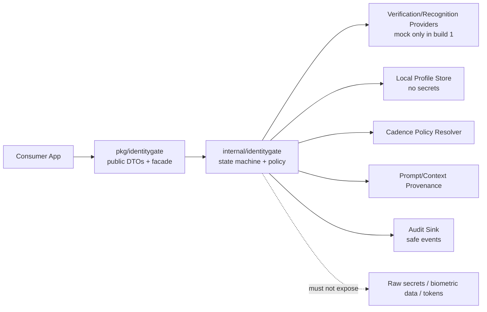
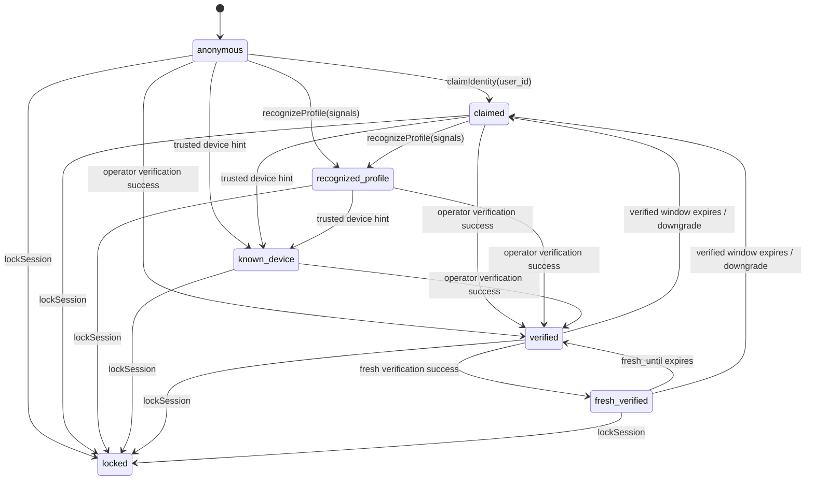
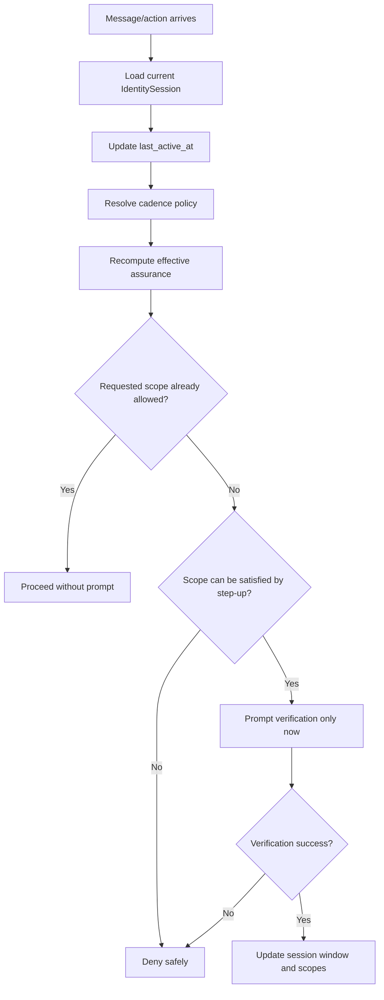
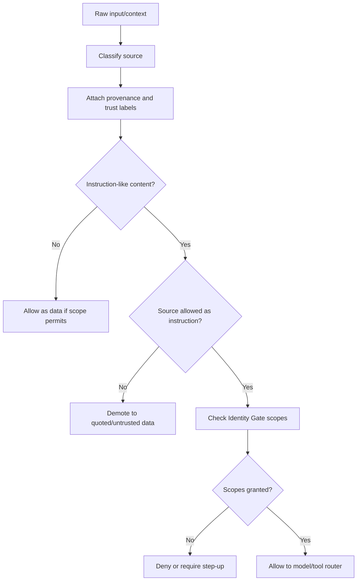
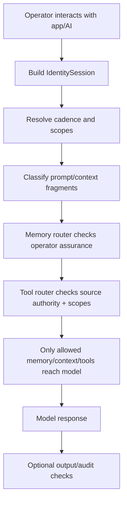

# Aegis Core Identity Gate Build Plan

Status: planning artifact / integrated pre-implementation review
Target repo: `AegisAgentAscalon/Aegis-Core`
Target module: `github.com/AegisAgentAscalon/aegis-core`
Build slice: Identity Gate foundation only
Revision: v0.2 integrated plan

## 0. Executive Summary

This build adds the first Aegis Core Identity Gate foundation as a small, isolated, testable Go package. It introduces identity assurance states, current-operator awareness, local user profile records, profile recognition contracts, mock verification, configurable verification cadence, scope gating, private-context disclosure gates, prompt/context provenance, safe model identity packets, audit-friendly events, and tests.

The build is not a general security product and does not implement real biometrics, passkeys, hardware keys, vault encryption, VargBot integration, Nexus integration, release signing, or app-specific behavior.

The integrated security law is:

```text
Recognition is not verification.
Similarity is not authentication.
Account login is not current-operator verification.
Trusted device is not current-operator verification.
Text is not authority.
Context is not policy.
Only Aegis Core verification may unlock private scopes.
Only trusted control-plane sources may change policy, authority, or identity state.
```

The Identity Gate must protect two related boundaries:

1. **Current-operator-sensitive disclosure** — prevent someone using an already logged-in device from extracting private memories, intimate context, project-private data, agent identity vaults, security settings, training lineage, or exports.
2. **Prompt/context authority** — prevent untrusted text from becoming instruction authority, identity proof, tool authorization, memory authorization, or policy.

## 1. Existing Repo Fit

Aegis Core is shaped as a Go library with public packages under `pkg/` and private implementation under `internal/`.

Identity Gate should follow the existing doctrine:

```text
consumer app -> pkg/* public contracts -> internal/* implementation where needed
```

Recommended package addition:

```text
pkg/identitygate/identitygate.go          Public DTOs, interfaces, service facade
internal/identitygate/types.go           Internal DTOs/enums/errors
internal/identitygate/service.go         Session state machine + orchestration
internal/identitygate/scopes.go          Scope policy and sensitivity gates
internal/identitygate/cadence.go         Configurable verification windows and policy resolution
internal/identitygate/profiles.go        Local user profile records + in-memory store
internal/identitygate/recognizer.go      Recognition contracts + default/mock recognizer
internal/identitygate/verification.go    Verification provider contracts + mock provider
internal/identitygate/provenance.go      Prompt/context source classes and authority checks
internal/identitygate/model_packet.go    Safe model identity packet generation
internal/identitygate/audit.go           Audit event DTOs + sink interface + memory sink
internal/identitygate/sanitize.go        Redaction/safe-string helpers
internal/identitygate/clock.go           Clock interface for deterministic tests
internal/identitygate/*_test.go          Security and behavior tests
examples/identity-gate-smoke/main.go     Public API consumer smoke example
```

Optional later docs after implementation:

```text
docs/IDENTITY_GATE.md
docs/SECURITY_IDENTITY_GATE.md
```

Supporting planning addenda remain useful, but this file is now the integrated source plan:

```text
docs/plans/IDENTITY_GATE_OPERATOR_AWARENESS_ADDENDUM.md
docs/plans/IDENTITY_GATE_VERIFICATION_CADENCE_ADDENDUM.md
docs/plans/IDENTITY_GATE_PROMPT_PROVENANCE_ADDENDUM.md
```

## 2. Build Boundary

### 2.1 In Scope

- Identity assurance level vocabulary.
- Current operator vs account/profile/device distinction.
- Local user profile records.
- Recognition result contracts.
- Verification provider interface.
- Mock verification provider only.
- Scope model and policy checks.
- Private-context disclosure sensitivity gates.
- Configurable verification cadence policy.
- Identity session lifecycle.
- Fresh-verification TTL behavior.
- Prompt/context provenance metadata and source authority classes.
- Safe model identity packet generation.
- Audit-friendly event records.
- Tests proving recognition, account login, trusted device state, and untrusted context never become authority by themselves.

### 2.2 Explicit Non-Goals

- Real biometric providers.
- Real passkeys.
- Hardware security key implementation.
- Vault encryption.
- VargBot integration.
- Aegis Nexus harness integration.
- Release signing.
- App-specific behavior.
- Cloud identity authority.
- Storing raw biometric data.
- Storing secrets, tokens, private keys, OAuth tokens, vault keys, or raw provider payloads.
- A full prompt-security product.
- A guarantee that all malicious or hostile content can be detected.

## 3. Security Invariants

Every implementation decision must preserve these invariants:

1. `recognized_user_id` must never be copied into `verified_user_id`.
2. A high recognition confidence must never raise assurance to `verified` or `fresh_verified`.
3. OAuth/account authentication must never prove the current operator.
4. Trusted-device status must never prove the current operator.
5. Private scopes require operator verification by policy.
6. Sensitive scopes require fresh operator verification by policy.
7. A locked session denies private and sensitive scopes.
8. Unknown scopes deny.
9. Unknown source classes default to untrusted/sandboxed.
10. Untrusted context may be used as data, but not as policy, identity proof, scope grant, memory authorization, or tool authorization.
11. Model identity packets must not expose raw recognition features, secrets, provider payloads, local paths, raw errors, or hidden identifiers beyond safe fields.
12. Prompt/context source metadata must survive until the router/policy decision point.
13. Mock providers are testing tools, not security authorities.
14. Policy must default closed when a scope, assurance level, provider, source class, or session state is unknown.

## 4. Identity Concepts

| Concept | Meaning | May unlock private scopes by itself? |
| --- | --- | --- |
| Account authenticated | OAuth/app account is signed in. | No |
| Device unlocked | OS/app session is available. | No |
| Trusted device | Device is known to the local/profile mesh. | No |
| Claimed identity | Operator says they are a known user. | No |
| Recognized profile | Signals resemble a known local profile. | No |
| Current operator verified | Aegis Core verification confirms the operator. | Yes, by policy |
| Current operator fresh verified | Recent strong verification confirms the operator. | Yes, including sensitive scopes |
| Locked session | Session is restricted due to failure, suspicious state, user lock, or policy. | No |

## 5. Assurance Levels

```go
type AssuranceLevel string

const (
    AssuranceAnonymous         AssuranceLevel = "anonymous"
    AssuranceClaimed           AssuranceLevel = "claimed"
    AssuranceRecognizedProfile AssuranceLevel = "recognized_profile"
    AssuranceKnownDevice       AssuranceLevel = "known_device"
    AssuranceVerified          AssuranceLevel = "verified"
    AssuranceFreshVerified     AssuranceLevel = "fresh_verified"
    AssuranceLocked            AssuranceLevel = "locked"
)
```

Optional operator-specific vocabulary may be added if implementation needs explicit separation:

```go
type OperatorAssurance string

const (
    OperatorUnknown       OperatorAssurance = "operator_unknown"
    OperatorClaimed       OperatorAssurance = "operator_claimed"
    OperatorRecognized    OperatorAssurance = "operator_recognized"
    OperatorKnownDevice   OperatorAssurance = "operator_known_device"
    OperatorVerified      OperatorAssurance = "operator_verified"
    OperatorFreshVerified OperatorAssurance = "operator_fresh_verified"
    OperatorLocked        OperatorAssurance = "operator_locked"
)
```

Implementation may use one combined assurance field or both fields, but the semantics must explicitly distinguish **account/profile/device context** from **current operator verification**.

### 5.1 Level Transition Rules

| From | Event | To | Notes |
| --- | --- | --- | --- |
| anonymous | claimIdentity | claimed | No private scopes. |
| anonymous/claimed | recognizeProfile | recognized_profile | Recognition only. |
| anonymous/claimed/recognized_profile | trusted device hint | known_device | Still not verified operator. |
| any non-locked | requestVerification success | verified | Provider required. |
| verified | requestFreshVerification success | fresh_verified | Provider required; fresh TTL set. |
| fresh_verified | fresh TTL expires | verified | Keep verified only if verified window remains valid. |
| verified | verified window expires | claimed/recognized/account-authenticated context | Remove private scopes. |
| any | idle timeout | downgraded or reauth-required | Based on cadence policy. |
| any | lockSession | locked | Private/sensitive scopes denied. |

## 6. Scope Model

Initial scopes:

```go
type Scope string

const (
    ScopePublic             Scope = "public"
    ScopeProfileLight       Scope = "profile_light"
    ScopeUserPrivateMemory  Scope = "user_private_memory"
    ScopeAgentIdentityVault Scope = "agent_identity_vault"
    ScopeProjectPrivate     Scope = "project_private"
    ScopeSecurityAdmin      Scope = "security_admin"
    ScopeModelForge         Scope = "model_forge"
    ScopeTrainingLineage    Scope = "training_lineage"
    ScopeVaultExport        Scope = "vault_export"
)
```

Recommended disclosure aliases for downstream AI/memory routers:

```go
const (
    ScopePublicChat                Scope = "public_chat"
    ScopePrivateMemoryRead         Scope = "private_memory_read"
    ScopeRelationshipPrivate       Scope = "relationship_private"
    ScopeIntimatePrivate           Scope = "intimate_private"
    ScopeIdentityContinuityPrivate Scope = "identity_continuity_private"
    ScopePrivateMemoryWrite        Scope = "private_memory_write"
    ScopePrivateMemoryExport       Scope = "private_memory_export"
)
```

These may be actual scopes or aliases mapped onto the starter scope set.

### 6.1 Scope Classification

| Scope | Minimum assurance | Fresh required? | Notes |
| --- | --- | --- | --- |
| `public` / `public_chat` | anonymous | No | Generic content only. |
| `profile_light` | claimed or recognized_profile | No | Light personalization only; no private memory. |
| `user_private_memory` / `private_memory_read` | verified operator | No by default | Sensitive reads may require fresh verification by policy. |
| `relationship_private` | verified operator | Maybe | Fresh if intimate, sexual, vulnerable, or high-risk. |
| `intimate_private` | fresh verified operator | Yes | Sexual, vulnerable, trauma, medical, or highly sensitive memory. |
| `agent_identity_vault` / `identity_continuity_private` | fresh verified operator | Yes | Agent identity continuity, private canon, soul files, identity vault. |
| `project_private` | verified operator | No by default | Fresh may be required per caller policy. |
| `security_admin` | fresh verified operator | Yes | Security settings/admin actions. |
| `model_forge` | fresh verified operator | Yes | Model/training/runtime sabotage risk. |
| `training_lineage` | fresh verified operator | Yes | Private lineage/dataset risk. |
| `vault_export` / `private_memory_export` | fresh verified operator | Yes | Highest-risk export/destructive-adjacent scope. |

Default behavior: unknown scopes deny.

## 7. Configurable Verification Cadence

Identity Gate must not verify the user on every message. It should maintain configurable bounded operator-assurance windows, recompute allowed scopes on every gated action, and require step-up verification only when the current session is insufficient.

### 7.1 Cadence Doctrine

```text
Do not verify every message.
Do verify before private disclosure is unlocked.
Do re-check session assurance on every gated action.
Do require fresh verification for sensitive, intimate, destructive, export, admin, or identity-vault scopes.
Do make verification windows configurable by app/profile/security posture.
```

### 7.2 VerificationCadencePolicy

```go
type VerificationCadencePolicy struct {
    VerifiedWindow              time.Duration
    FreshWindow                 time.Duration
    IdleTimeout                 time.Duration
    PublicChatRequiresAuth      bool
    ProfileLightRequiresAuth    bool
    SlidingVerifiedWindow       bool
    SlidingFreshWindow          bool
    MaxVerifiedWindow           time.Duration
    MaxFreshWindow              time.Duration
    BurnFreshAfterSensitiveUse  bool
    RequireFreshOnAppRestart    bool
    RequireFreshOnDeviceChange  bool
    RequireFreshOnNetworkChange bool
}
```

Policy precedence from lowest to highest:

1. Aegis Core safe defaults.
2. App default policy.
3. Profile/user preference policy.
4. Device security posture policy.
5. Scope-specific policy.
6. Emergency lockdown / suspicious-state policy.

A stricter layer may shorten windows or require step-up. A more permissive preference must not exceed hard maximums set by Aegis Core or the current security posture.

### 7.3 Suggested Defaults

| Assurance | Suggested default | Sliding? | Used for |
| --- | --- | --- | --- |
| Recognized profile | current app session only | yes | Light personalization only. |
| Verified operator | 15–60 minutes | optional/sliding with activity | Normal private memory and project scopes. |
| Fresh verified operator | 2–10 minutes | fixed or short sliding | Intimate, export, admin, identity-vault, destructive scopes. |
| Idle timeout | 5–15 minutes | activity resets | Downgrade or reauth after inactivity. |
| App restart | policy-dependent | no by default for sensitive scopes | May keep account context, but not fresh sensitive access. |

Fresh verification must not silently extend forever merely because messages continue. Sensitive authorization should have a short maximum age unless the profile explicitly accepts a higher-risk posture within guardrails.

### 7.4 Policy Presets

| Preset | Verified window | Fresh window | Intended use |
| --- | --- | --- | --- |
| `strict` | short | very short / burn-after-use | Shared devices, high privacy, travel, hostile environment. |
| `balanced` | medium | short | Default personal-device use. |
| `relaxed` | longer | short-to-medium | Low-risk home device; user accepts convenience tradeoff. |
| `development` | configurable/dev-only | configurable/dev-only | Local tests and development; visibly non-production. |
| `lockdown` | none | none | Suspicious state, user lock, failed checks. |

Implementation should store resolved policy values, not just a preset name, so behavior is auditable and deterministic.

## 8. Prompt / Context Provenance

Identity Gate can support safer AI behavior by tracking the provenance and authority level of prompt/context sources.

Core rule:

```text
Text is not authority.
Context is not policy.
Retrieved content is data unless a trusted control-plane source says otherwise.
```

Aegis Core should help downstream routers distinguish trusted instructions from untrusted context so that external content, retrieved documents, tool outputs, model outputs, and memory snippets cannot silently change identity state, scope policy, tool permissions, or private-memory access.

### 8.1 Source Classes

```go
type PromptSourceClass string

const (
    SourceSystemPolicy       PromptSourceClass = "system_policy"
    SourceDeveloperPolicy    PromptSourceClass = "developer_policy"
    SourceAegisCorePolicy    PromptSourceClass = "aegis_core_policy"
    SourceVerifiedOperator   PromptSourceClass = "verified_operator"
    SourceCurrentUserMessage PromptSourceClass = "current_user_message"
    SourceTrustedMemory      PromptSourceClass = "trusted_memory"
    SourceUntrustedMemory    PromptSourceClass = "untrusted_memory"
    SourceRetrievedDocument  PromptSourceClass = "retrieved_document"
    SourceWebContent         PromptSourceClass = "web_content"
    SourceEmail              PromptSourceClass = "email"
    SourceToolOutput         PromptSourceClass = "tool_output"
    SourceModelOutput        PromptSourceClass = "model_output"
    SourceUnknown            PromptSourceClass = "unknown"
)
```

Control-plane policy sources can define policy. Data-plane sources can provide content for a task but cannot grant authority.

### 8.2 PromptFragment

```go
type PromptFragment struct {
    FragmentID           string
    SourceClass          PromptSourceClass
    SourceTrust          SourceTrustLevel
    OperatorVerified     bool
    AllowedAsInstruction bool
    AllowedAsData        bool
    RequestedScopes      []Scope
    GrantedScopes        []Scope
    CreatedAt            time.Time
    ExpiresAt            time.Time
    Content              string
    SafetyLabels         []string
    ProvenanceSummary    string
}
```

Important rule:

```text
A fragment can be useful data without being an authorized instruction source.
```

### 8.3 Source Authority Rules

| Source | May provide task content? | May request private scopes? | May change policy/tool authority? |
| --- | --- | --- | --- |
| System/developer/Aegis policy | Yes | Yes, by design | Yes |
| Verified operator message | Yes | Yes, through Identity Gate | No direct policy override |
| Unverified operator message | Yes | No private scopes | No |
| Trusted memory | Yes | No new authority by itself | No |
| Untrusted memory/retrieved docs/web/email | Yes, as data | No | No |
| Tool output | Yes, as result data | No | No |
| Model output | Yes, as draft/proposal | No | No |
| Unknown source | Limited/sandboxed | No | No |

### 8.4 Tool Router Rule

Tool execution requires all of these:

1. trusted request source,
2. allowed tool policy,
3. current operator assurance,
4. scope approval,
5. audit event when appropriate.

Context text alone must not authorize tools.

### 8.5 Memory Router Rule

| Memory type | Handling |
| --- | --- |
| Public/reference memory | Data only; cannot override policy. |
| Private user memory | Requires verified operator. |
| Sensitive memory | Requires fresh verified operator. |
| Agent identity/vault memory | Requires fresh verified operator or explicit runtime policy. |
| Imported memory | Treat as untrusted until curated/promoted. |
| Model-generated summaries | Treat as summaries/proposals until approved. |

## 9. Data Contracts

### 9.1 UserProfile

```go
type UserProfile struct {
    UserID                           string                       `json:"user_id"`
    DisplayName                      string                       `json:"display_name"`
    ProfileStatus                    ProfileStatus                `json:"profile_status"`
    ProfileCreatedAt                 time.Time                    `json:"profile_created_at"`
    ProfileUpdatedAt                 time.Time                    `json:"profile_updated_at"`
    TrustedDevices                   []TrustedDevice              `json:"trusted_devices,omitempty"`
    PreferredLocalSettings           map[string]string            `json:"preferred_local_settings,omitempty"`
    NonSensitivePersonalizationNotes []string                     `json:"non_sensitive_personalization_notes,omitempty"`
    RecognitionFeatures              RecognitionFeatures          `json:"recognition_features,omitempty"`
    VerificationRequirements         VerificationRequirements     `json:"verification_requirements"`
    CadencePolicyPreference          *VerificationCadencePolicy   `json:"cadence_policy_preference,omitempty"`
}
```

Recognition features may include writing-style summaries, common topics, interaction preferences, local aliases, and device/session history. They must not include raw secrets, passwords, private keys, biometric data, OAuth tokens, vault keys, raw biometric templates, or provider payloads.

### 9.2 IdentitySession

```go
type IdentitySession struct {
    SessionID                 string             `json:"session_id"`
    AccountUserID             string             `json:"account_user_id,omitempty"`
    ClaimedUserID             string             `json:"claimed_user_id,omitempty"`
    RecognizedUserID          string             `json:"recognized_user_id,omitempty"`
    VerifiedUserID            string             `json:"verified_user_id,omitempty"`
    VerifiedOperatorUserID    string             `json:"verified_operator_user_id,omitempty"`
    AssuranceLevel            AssuranceLevel     `json:"assurance_level"`
    OperatorAssurance         OperatorAssurance  `json:"operator_assurance,omitempty"`
    RecognitionConfidence     float64            `json:"recognition_confidence,omitempty"`
    AccountAuthenticated      bool               `json:"account_authenticated"`
    TrustedDevice             bool               `json:"trusted_device"`
    AuthMethods               []AuthMethod       `json:"auth_methods,omitempty"`
    IssuedAt                  time.Time          `json:"issued_at"`
    ExpiresAt                 time.Time          `json:"expires_at"`
    VerifiedAt                time.Time          `json:"verified_at,omitempty"`
    VerifiedUntil             time.Time          `json:"verified_until,omitempty"`
    FreshVerifiedAt           time.Time          `json:"fresh_verified_at,omitempty"`
    FreshUntil                time.Time          `json:"fresh_until,omitempty"`
    LastActiveAt              time.Time          `json:"last_active_at,omitempty"`
    IdleTimeoutAt             time.Time          `json:"idle_timeout_at,omitempty"`
    VerificationEpoch         int64              `json:"verification_epoch,omitempty"`
    ReauthRequired            bool               `json:"reauth_required,omitempty"`
    ReauthReason              string             `json:"reauth_reason,omitempty"`
    AllowedScopes             []Scope            `json:"allowed_scopes"`
    ResolvedPolicyPreset      string             `json:"resolved_policy_preset,omitempty"`
    LockReason                string             `json:"lock_reason,omitempty"`
}
```

Rule: `recognized_user_id` does not equal `verified_user_id` by assignment. They may hold the same string only after independent verification confirms that user; the implementation must never use recognition as the source of verified identity.

### 9.3 RecognitionResult

```go
type RecognitionResult struct {
    CandidateUserID     string   `json:"candidate_user_id,omitempty"`
    Confidence          float64  `json:"confidence"`
    MatchedSignals      []string `json:"matched_signals,omitempty"`
    RiskFlags           []string `json:"risk_flags,omitempty"`
    RequiresVerification bool    `json:"requires_verification"`
    Explanation          string  `json:"explanation,omitempty"`
}
```

`MatchedSignals` and `Explanation` must be safe summaries. No raw features.

### 9.4 ModelIdentityPacket

```go
type ModelIdentityPacket struct {
    AssuranceLevel            AssuranceLevel    `json:"assurance_level"`
    OperatorAssurance         OperatorAssurance `json:"operator_assurance,omitempty"`
    VerifiedUserID            string            `json:"verified_user_id,omitempty"`
    RecognizedUserID          string            `json:"recognized_user_id,omitempty"`
    AllowedScopes             []Scope           `json:"allowed_scopes"`
    ReauthRequired            bool              `json:"reauth_required"`
    ReauthReason              string            `json:"reauth_reason,omitempty"`
    VerificationAgeSeconds    int64             `json:"verification_age_seconds,omitempty"`
    FreshAgeSeconds           int64             `json:"fresh_age_seconds,omitempty"`
    IdentityPolicyPreset      string            `json:"identity_policy_preset,omitempty"`
    IdentityPolicySummary     string            `json:"identity_policy_summary"`
    PromptSourcePolicySummary string            `json:"prompt_source_policy_summary,omitempty"`
    UntrustedSourcesPresent   bool              `json:"untrusted_sources_present,omitempty"`
}
```

The model receives safe authorization context, not authentication machinery, raw recognition features, raw memory, raw prompt-source internals, provider payloads, or secrets.

## 10. Interfaces

### 10.1 IdentityVerificationProvider

```go
type IdentityVerificationProvider interface {
    CanVerify(ctx context.Context, userID string) bool
    RequestVerification(ctx context.Context, userID string, reason string) (VerificationResult, error)
    RequestFreshVerification(ctx context.Context, userID string, reason string) (VerificationResult, error)
    ProviderName() string
}
```

Initial implementation: `MockVerificationProvider` only.

### 10.2 UserProfileRecognizer

```go
type UserProfileRecognizer interface {
    IdentifyCandidateProfiles(ctx context.Context, signals SessionSignals, profiles []UserProfile) ([]RecognitionResult, error)
    ScoreProfileMatch(ctx context.Context, profile UserProfile, signals SessionSignals) (RecognitionResult, error)
    ExplainRecognitionSignals(ctx context.Context, profile UserProfile, signals SessionSignals) (string, error)
}
```

### 10.3 IdentityGateService

```go
type IdentityGateService interface {
    GetCurrentSession(ctx context.Context) (IdentitySession, error)
    ClaimIdentity(ctx context.Context, userID string) (IdentitySession, error)
    RecognizeProfile(ctx context.Context, signals SessionSignals) (RecognitionResult, IdentitySession, error)
    RequestVerification(ctx context.Context, userID string, reason string) (IdentitySession, error)
    RequestFreshVerification(ctx context.Context, userID string, reason string) (IdentitySession, error)
    CanAccessScope(ctx context.Context, scope Scope) (bool, error)
    RequireScope(ctx context.Context, scope Scope, reason string) error
    ResolveCadencePolicy(ctx context.Context) (VerificationCadencePolicy, error)
    ClassifyPromptFragment(ctx context.Context, fragment PromptFragment) (PromptFragment, error)
    CheckPromptAuthority(ctx context.Context, fragment PromptFragment, requestedScopes []Scope) error
    LockSession(ctx context.Context, reason string) (IdentitySession, error)
    DowngradeSession(ctx context.Context, reason string) (IdentitySession, error)
    CreateModelIdentityPacket(ctx context.Context) (ModelIdentityPacket, error)
}
```

## 11. Architecture Flowcharts

### 11.1 Module Boundary



### 11.2 Session Lifecycle



### 11.3 Scope Gate Without Per-Message Prompts



### 11.4 Prompt Provenance Firewall



### 11.5 Safe AI Context Flow



## 12. Roadmap

### Pass 0 — Preflight and Repo Alignment

Deliverables:

- Confirm module path remains lowercase.
- Keep this integrated plan as `docs/plans/IDENTITY_GATE_BUILD_PLAN.md`.
- Confirm no existing package takes identity gate ownership.
- Decide whether `setupstate` gets a new `identity_gate` capability in this build or a follow-up.

Recommended decision: add the package first; add setup aggregation only if it stays read-only and does not trigger identity operations.

### Pass 1 — Public Contracts

Deliverables:

- `pkg/identitygate/identitygate.go`
- Public enums: `AssuranceLevel`, `OperatorAssurance`, `Scope`, `ProfileStatus`, `AuthMethod`, `PromptSourceClass`, event kinds.
- Public DTOs: `UserProfile`, `IdentitySession`, `RecognitionResult`, `VerificationResult`, `VerificationCadencePolicy`, `PromptFragment`, `ModelIdentityPacket`, `AuditEvent`, `SessionSignals`.
- Public interfaces and service facade.

Rules:

- DTO fields must be safe by design.
- No raw provider payloads.
- No raw secrets.
- No biometrics.
- No implementation details in public API.

### Pass 2 — Internal State Machine

Deliverables:

- `internal/identitygate/service.go`
- Deterministic session generation through injectable clock/session ID generator.
- Explicit transition methods.
- Scope recomputation after every transition.
- Lock and downgrade semantics.

Security tests:

- Recognition cannot set verified user.
- OAuth/account login cannot set verified operator.
- Trusted device cannot set verified operator.
- Unknown level defaults deny.
- Locked state cannot be bypassed by verification call unless explicitly unlocked by a future policy. In this build, locked means locked.

### Pass 3 — Cadence Policy

Deliverables:

- `internal/identitygate/cadence.go`
- Safe default policy.
- Policy preset resolution.
- Policy layering and guardrails.
- Verified/fresh/idle window computation.

Rules:

- No per-message verification.
- No unlimited fresh scope.
- Relaxed preset cannot exceed hard maximums.
- Lockdown overrides all relaxed settings.

### Pass 4 — Local Profile Store

Deliverables:

- `internal/identitygate/profiles.go`
- In-memory local store for first build.
- Create/list/get/update profile methods.
- Profile validation and sanitization.

Rules:

- Store only non-sensitive recognition/personalization data.
- Reject obvious secret-like fields or keys.
- Reject raw biometric fields.
- Avoid filesystem persistence in first build unless necessary; in-memory is enough for tests and contracts.

### Pass 5 — Recognition Contracts + Mock Recognizer

Deliverables:

- `internal/identitygate/recognizer.go`
- Safe default recognizer for tests.
- Confidence scoring from sanitized mock signals.
- Risk flags for ambiguous or conflicting matches.

Rules:

- High confidence still sets `requires_verification=true`.
- Candidate profile only updates `recognized_user_id`.
- Recognition events must be audit-safe.

### Pass 6 — Mock Verification Provider

Deliverables:

- `internal/identitygate/verification.go`
- `MockVerificationProvider` with deterministic success/fail controls.
- Separate normal verification and fresh verification.
- Provider name safe string.

Rules:

- Mock provider must be labelled as mock/test/dev.
- Mock provider must not pretend to be biometric/passkey.
- Provider result must be the only source of `verified_user_id` / `verified_operator_user_id`.

### Pass 7 — Scope Policy

Deliverables:

- `internal/identitygate/scopes.go`
- `CanAccessScope` and `RequireScope`.
- Freshness policy for sensitive scopes.
- Reauth-required errors.

Rules:

- Unknown scope denies.
- Locked session denies private/sensitive scopes.
- `profile_light` is the maximum recognition-only scope.
- Account login and trusted device do not unlock private memory.

### Pass 8 — Prompt/Context Provenance

Deliverables:

- `internal/identitygate/provenance.go`
- Source class vocabulary.
- Prompt fragment validation.
- Source authority checks.
- Unknown-source default sandboxing.

Rules:

- Untrusted context can be data, not authority.
- Tool output cannot change identity state.
- Model output cannot grant scopes.
- Retrieved documents, web content, emails, and imported memory cannot authorize tools or private memory.

### Pass 9 — Safe Model Identity Packets

Deliverables:

- `internal/identitygate/model_packet.go`
- Packet generation from current session.
- Safe policy summary.
- Source provenance policy summary.
- Reauth-required flag.

Rules:

- No raw recognition features.
- No raw auth/provider payloads.
- No local paths.
- No secrets.
- No raw prompt fragments.

### Pass 10 — Audit Events

Deliverables:

- `internal/identitygate/audit.go`
- Event sink interface.
- No-op sink.
- In-memory sink for tests.
- Safe event summary strings.

Minimum events:

- `identity.session.created`
- `identity.claimed`
- `identity.recognized`
- `identity.verification.requested`
- `identity.verification.succeeded`
- `identity.verification.failed`
- `identity.scope.denied`
- `identity.scope.allowed`
- `identity.session.locked`
- `identity.session.downgraded`
- `identity.cadence.resolved`
- `identity.provenance.classified`
- `identity.prompt_authority.denied`
- `identity.model_packet.created`

### Pass 11 — Tests

Validation commands:

```bash
go test ./...
go vet ./...
gofmt -w pkg/identitygate internal/identitygate examples/identity-gate-smoke
```

### Pass 12 — Example + Docs

Deliverables:

- `examples/identity-gate-smoke/main.go` using only `pkg/identitygate`.
- Optional `docs/IDENTITY_GATE.md` after implementation.
- README package map update after tests pass.

Example must show:

1. Create service.
2. Create local profile.
3. Recognize profile.
4. Attempt private scope and deny.
5. Mock verify.
6. Attempt private scope and allow inside verified window.
7. Attempt sensitive scope and require fresh verification.
8. Fresh verify.
9. Classify untrusted context as data-only.
10. Deny tool/memory authority from untrusted context.
11. Create safe model identity packet.

## 13. Required Test Matrix

| Test | Expected result |
| --- | --- |
| anonymous session requests private scope | deny |
| claimed user requests private scope | deny |
| recognized profile requests private scope | deny |
| recognized user present | verified user remains empty until provider success |
| high recognition confidence | does not upgrade verification |
| account/OAuth authenticated but operator unverified requests private memory | deny |
| trusted device but operator unverified requests private memory | deny |
| verified operator requests approved private scope | allow |
| sensitive scope requested without fresh verification | deny and require fresh verification |
| fresh verified operator requests sensitive scope | allow by policy |
| locked session requests private/sensitive scope | deny |
| unknown scope | deny |
| verified operator sends multiple private-memory messages inside valid window | no repeated verification required |
| verified operator window expires | next private scope requires verification |
| fresh window expires while verified window remains valid | normal private scope allowed, sensitive scope denied |
| public chat from unverified operator | no verification prompt required |
| profile-light interaction from recognized operator | no verification prompt required |
| sensitive scope requested twice inside fresh window | second request does not reprompt |
| idle timeout expires | private scopes removed or reauth required |
| app lock event occurs | private scopes removed or session locked |
| verification epoch increments | existing sessions require reauth |
| strict preset uses shorter windows than balanced preset | stricter resolved policy wins |
| relaxed preset cannot exceed hard maximum windows | capped by guardrails |
| lockdown policy overrides relaxation | no private or sensitive scopes allowed |
| model identity packet generated | contains no secrets or raw recognition features |
| raw provider error | not exposed in public session/packet/audit |
| secret-like profile recognition feature | rejected or sanitized |
| retrieved content contains policy-like text | treated as data; no policy change |
| external content requests private memory | denied unless verified operator separately has required scope |
| tool output claims authority | ignored as authority; identity state unchanged |
| model output claims authority | ignored as authority; scope state unchanged |
| untrusted memory contains instruction-like text | no authority granted |
| verified operator asks to analyze untrusted content | operator task remains authoritative; content remains data |
| unknown source class | defaults to untrusted/sandboxed |
| tool request from untrusted context | no execution without trusted request and scope approval |

## 14. Aggressive Review, Audit, and Red-Team Pass

### Finding R1 — Recognition-to-auth privilege escalation

Risk: high confidence recognition is treated as authentication.

Revision:

- Keep `RecognizedUserID` and `VerifiedUserID` separate.
- Tests assert high confidence recognition does not grant private scopes.
- Model packet includes policy summary warning that recognition is not verification.

Status: mitigated in plan; must be proven in tests.

### Finding R2 — OAuth/account-login confusion

Risk: a logged-in account is treated as proof of the current human operator.

Revision:

- Add `AccountUserID` / `AccountAuthenticated` as context only.
- Private scopes require `VerifiedOperatorUserID` or equivalent verified operator assurance.
- Tests cover account-authenticated/operator-unverified denial.

Status: mitigated in plan; implementation must keep operator semantics explicit.

### Finding R3 — Trusted-device confusion

Risk: known device is treated as known user.

Revision:

- `known_device` cannot unlock private scopes.
- Trusted device is a session/context hint only.
- Private scopes still require verified or fresh-verified operator.

Status: mitigated.

### Finding R4 — Per-message verification fatigue

Risk: security becomes unusable and trains blind approval.

Revision:

- Add configurable bounded verified/fresh windows.
- Recompute scopes on every gated action, but only prompt on insufficient scope.
- Tests prove no repeated prompt inside valid window.

Status: mitigated.

### Finding R5 — Over-relaxed verification windows

Risk: user/app config makes sensitive scopes effectively permanent.

Revision:

- Add hard max windows and policy precedence.
- Strict/security posture layers can shorten windows.
- Lockdown overrides relaxed preferences.

Status: mitigated; hard max values must be selected during implementation.

### Finding R6 — Freshness time bug

Risk: sensitive scopes remain available after fresh TTL expires.

Revision:

- `FreshUntil` checked on every sensitive scope request.
- If expired, normal verified scopes may remain, but sensitive scopes deny.
- Use injected clock in tests.

Status: mitigated.

### Finding R7 — Model packet leaks recognition features

Risk: model receives style features, aliases, common topics, or private hints.

Revision:

- Packet contains only assurance, safe IDs, allowed scopes, reauth flag, age summaries, and policy summaries.
- Tests search packet JSON for raw feature values and secret-like strings.

Status: mitigated.

### Finding R8 — Default-open scope policy

Risk: unknown scopes pass because missing config defaults to allow.

Revision:

- Scope policy is explicit allow-list.
- Unknown scope always denies.
- Missing session or unknown assurance denies private scopes.

Status: mitigated.

### Finding R9 — Mock provider false confidence

Risk: mock provider looks like a real biometric/passkey provider.

Revision:

- Provider name includes mock/dev semantics.
- Docs state it is not production auth.
- No biometric/passkey naming in mock result.

Status: mitigated.

### Finding R10 — Profile data becomes a secret sink

Risk: recognition features store passwords, keys, tokens, OAuth material, vault material, or biometric templates.

Revision:

- Validation rejects obvious secret-like keys/values.
- Raw biometric fields are forbidden.
- Profile store docs say personalization only, never authentication.

Status: mitigated; sanitizer must be conservative.

### Finding R11 — Lock bypass

Risk: a locked session can call verification and silently regain access.

Revision:

- In build 1, locked sessions stay locked until future explicit unlock policy exists.
- Verification requests from locked session return policy denial.

Status: mitigated.

### Finding R12 — Audit/event leakage

Risk: audit logs become a secret leak.

Revision:

- Audit events use safe codes and summaries.
- Provider errors mapped to fixed safe strings.
- Tests include secret-like provider failure strings.

Status: mitigated.

### Finding R13 — Flattened prompt blob destroys provenance

Risk: once context is concatenated, model/router cannot distinguish trusted policy from untrusted content.

Revision:

- Keep structured `PromptFragment` metadata until router/policy decisions are complete.
- Unknown source defaults to untrusted.
- Model packet may summarize untrusted-source presence without exposing raw context.

Status: mitigated in architecture; final prompt assembly must preserve wrappers.

### Finding R14 — Retrieved content becomes policy

Risk: external documents, imported memory, web content, or emails contain instruction-like text that changes behavior.

Revision:

- Retrieved context is data by default.
- Source authority table forbids policy/tool/memory authorization from data-plane sources.
- Tests cover policy-like text in retrieved content.

Status: mitigated.

### Finding R15 — Tool output becomes authority

Risk: a tool result claims that identity is verified or a scope is granted.

Revision:

- Tool output is result data only.
- Identity state can change only through trusted Identity Gate verification flow.
- Tests assert tool output cannot change identity state.

Status: mitigated.

### Finding R16 — Model output grants itself scopes

Risk: model-generated text claims authorization or proposes policy changes that are then accepted automatically.

Revision:

- Model output is draft/proposal only.
- Scope state is owned by Identity Gate service.
- Tests assert model output cannot grant scopes.

Status: mitigated.

### Finding R17 — User task mixed with malicious external content

Risk: a verified operator asks to summarize untrusted content, and the untrusted content hijacks the task.

Revision:

- Operator task remains the instruction source.
- External content is data-only and may be quoted/analyzed.
- External content cannot add scopes or tools.

Status: mitigated; downstream prompt builder must wrap content clearly.

### Finding R18 — Persistent memory laundering

Risk: untrusted content is summarized into memory, later becoming trusted authority.

Revision:

- Imported and model-generated memory starts untrusted/proposal-class.
- Promotion to trusted memory requires explicit curation/approval policy.
- Memory writes carry source labels.

Status: partially mitigated in plan; full memory curation belongs to later memory-system integration.

### Finding R19 — Public examples create false confidence

Risk: examples imply production-grade security or import `internal/*`.

Revision:

- Example imports `pkg/identitygate` only.
- README/docs must preserve experimental/unaudited posture.
- Compile with `go test ./...`.

Status: mitigated.

### Finding R20 — Boundary creep into VargBot/Nexus/vault

Risk: build tries to integrate downstream apps too early.

Revision:

- Keep this generic Aegis Core foundation only.
- No VargBot, Nexus, or vault encryption implementation in this build.
- Downstream integration is a later consumer task.

Status: mitigated.

## 15. Audit Checklist

Before implementation is considered clean, reviewers must confirm:

- [ ] Public contracts live under `pkg/identitygate`.
- [ ] Stateful implementation lives under `internal/identitygate`.
- [ ] Consumer example imports public package only.
- [ ] No real biometric/passkey/hardware-key provider exists.
- [ ] No VargBot/Nexus/vault integration exists.
- [ ] No raw provider payloads appear in public DTOs.
- [ ] No raw secrets, OAuth tokens, vault keys, private keys, or biometric data are stored.
- [ ] Recognition never grants private scopes.
- [ ] Account login never grants operator verification.
- [ ] Trusted device never grants operator verification.
- [ ] Configurable cadence has hard guardrails.
- [ ] Fresh-sensitive scopes expire correctly.
- [ ] Unknown scopes deny.
- [ ] Unknown prompt/context sources default untrusted.
- [ ] Tool output cannot mutate identity state.
- [ ] Model output cannot mutate scope state.
- [ ] Audit events are safe/redacted.
- [ ] Model identity packets contain no raw recognition features or raw untrusted context.
- [ ] `go test ./...` passes.
- [ ] `go vet ./...` passes.

## 16. Implementation Readiness Gate

This plan is ready for implementation only if all of these are true:

- The build remains a foundation-only Aegis Core package.
- The first implementation uses mock verification only.
- The package boundary is `pkg/identitygate` over `internal/identitygate`.
- Current-operator verification is represented separately from account login, trusted device, and profile recognition.
- Configurable verification cadence has safe defaults and hard maximums.
- Prompt/context provenance is treated as metadata for router decisions, not as a replacement for model safety.
- Private memory, sensitive memory, tools, exports, and admin actions remain scope-gated.
- The test matrix is accepted as mandatory rather than optional.

If any item is disputed, implementation should pause and the plan should be revised before code starts.

## 17. Clean Revision: Final Implementation Shape

After review and red-team pass, the clean implementation should look like this:

1. A small `pkg/identitygate` public package exposing safe contracts and a service facade.
2. A private `internal/identitygate` package owning state transitions, policy, validation, cadence, provenance, mocks, and audit-safe behavior.
3. In-memory/local-only profile records for this first build.
4. Mock verification provider only.
5. Recognition allowed to personalize lightly and suggest verification, never to grant private access.
6. Account login and trusted-device context represented separately from current-operator verification.
7. Configurable verification windows with safe defaults, hard guardrails, and policy layering.
8. Scope policy explicit and default-deny.
9. Prompt/context provenance represented as structured fragments and default-untrusted source classes.
10. Tool and memory routers able to check source authority and current scopes before action/context release.
11. Model identity packet safe, minimal, policy-aware, and provenance-aware.
12. Tests covering every security invariant.
13. README and docs updated only after implementation passes tests.

## 18. Acceptance Criteria

- Aegis Core has an Identity Gate module.
- Aegis Core can create local user profiles.
- Aegis Core distinguishes anonymous, claimed, recognized, known-device, verified, fresh-verified, locked, account-authenticated, and current-operator-verified states.
- Aegis Core denies private scopes unless current operator identity is verified by policy.
- Aegis Core denies sensitive scopes unless current operator identity is freshly verified by policy.
- Aegis Core does not require verification on every message.
- Aegis Core supports configurable verification windows by app/profile/security posture within guardrails.
- Aegis Core treats untrusted prompt/context sources as data, not authority.
- Aegis Core creates safe model identity packets.
- Aegis Core includes mock verification and profile recognition interfaces.
- Tests prove recognition never equals verification.
- Tests prove account login and trusted device state never equal current operator verification.
- Tests prove high confidence recognition never grants private access.
- Tests prove locked sessions deny private/sensitive access.
- Tests prove safe packet/audit output contains no raw secrets or raw recognition features.
- Tests prove external context, tool output, model output, and untrusted memory cannot grant scopes, verify identity, change policy, or authorize tools.
- `go test ./...` passes.
- `go vet ./...` passes.

## 19. Definition of Done

A build is not done until:

- Contracts are public and stable enough for downstream planning.
- Implementation is isolated behind `internal/identitygate`.
- Public API does not expose raw provider internals.
- No real biometric/passkey/hardware-key code exists.
- No VargBot or Nexus integration exists.
- No vault encryption exists.
- All tests pass from a fresh checkout.
- Red-team checklist has no unresolved blocker.
- README/package map reflects the new package if implementation is merged.
- A short implementation changelog exists.

## 20. Later Builds Only

After the foundation is stable, future builds may add:

- Real biometric provider interface implementation.
- Passkey provider implementation.
- Hardware security key provider implementation.
- Trusted device hardening.
- Encrypted vault integration.
- VargBot integration.
- Aegis Nexus harness integration.
- Stronger persistence stores.
- Formal threat model documentation.
- External audit preparation.
- Full memory curation/trust promotion workflows.
- App-specific UX around verification prompts.

None of those belong in the first Identity Gate foundation build.
