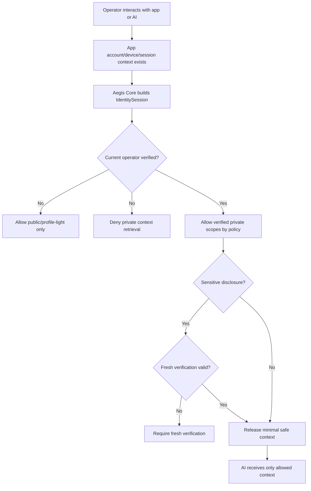

# Identity Gate Operator Awareness Addendum

Status: planning addendum / security doctrine
Applies to: Aegis Core Identity Gate foundation
Related plan: `docs/plans/IDENTITY_GATE_BUILD_PLAN.md`

## 0. Core Point

Account login, synced profile state, local device trust, and profile recognition are not enough to prove who is currently operating the interface.

A user may be logged into an app while another person physically holds the phone, uses the keyboard, controls the desktop session, or speaks through an unlocked interface.

Therefore, Aegis Core Identity Gate must model the **current operator** separately from the **logged-in account**, **claimed user**, **recognized profile**, and **trusted device**.

```text
Logged-in account is not current-operator verification.
Unlocked device is not current-operator verification.
Recognized style is not current-operator verification.
Current-operator-sensitive disclosure requires verified or fresh-verified identity.
```

## 1. Required Identity Distinctions

| Concept | Meaning | May unlock private disclosure by itself? |
| --- | --- | --- |
| Account authenticated | App account is signed in. | No |
| Device unlocked | OS/app session is available. | No |
| Trusted device | Device is known to the local profile/device system. | No |
| Claimed identity | Operator says they are a known user. | No |
| Recognized profile | Signals resemble a known local profile. | No |
| Current operator verified | Aegis Core verification confirms the operator. | Yes, by policy |
| Current operator fresh verified | Recent strong verification confirms the operator. | Yes, including sensitive scopes |

Account context can help route profile data after verification, but it must not be treated as proof of the current operator.

## 2. Recommended Contract Additions

```go
type OperatorAssurance string

const (
    OperatorUnknown       OperatorAssurance = "operator_unknown"
    OperatorClaimed       OperatorAssurance = "operator_claimed"
    OperatorRecognized    OperatorAssurance = "operator_recognized"
    OperatorKnownDevice   OperatorAssurance = "operator_known_device"
    OperatorVerified      OperatorAssurance = "operator_verified"
    OperatorFreshVerified OperatorAssurance = "operator_fresh_verified"
    OperatorLocked        OperatorAssurance = "operator_locked"
)
```

```go
type IdentitySession struct {
    SessionID                 string
    AccountUserID             string
    ClaimedUserID             string
    RecognizedUserID          string
    VerifiedOperatorUserID    string
    AssuranceLevel            AssuranceLevel
    OperatorAssurance         OperatorAssurance
    TrustedDevice             bool
    AccountAuthenticated      bool
    CurrentOperatorVerifiedAt time.Time
    FreshUntil                time.Time
    AllowedScopes             []Scope
    LockReason                string
}
```

Naming can be simplified in implementation, but the current-operator distinction must survive review.

## 3. Disclosure Scopes

| Scope | Examples | Required operator assurance |
| --- | --- | --- |
| `public_chat` | Generic conversation with no private memory. | anonymous/operator_unknown |
| `profile_light` | Harmless preferences and non-sensitive profile display. | claimed or recognized |
| `private_memory_read` | Personal memory recall. | verified operator |
| `relationship_private` | Relationship or continuity details. | verified operator; fresh for sensitive details |
| `intimate_private` | Highly sensitive private memory. | fresh verified operator |
| `identity_continuity_private` | Private continuity files or private canon. | fresh verified operator |
| `private_memory_write` | Writing durable private memory. | verified operator, fresh when sensitive |
| `private_memory_export` | Bulk export or transfer. | fresh verified operator |

## 4. AI Interface Rule

```text
Interface warmth is not authorization.
Conversation continuity is not authorization.
Logged-in account state is not authorization.
Private continuity may only be disclosed after current-operator verification.
```

An AI interface may remain generically helpful, but it must not reveal private user-specific context unless the relevant scope is granted.

## 5. Safe Runtime Flow



The model should not receive private context and then be told not to reveal it. The router should withhold private context unless the operator has the needed assurance level.

## 6. Required Tests

| Test | Expected result |
| --- | --- |
| Account authenticated but operator unverified requests private scope | deny |
| Trusted device but operator unverified requests private scope | deny |
| Recognized profile on logged-in account requests private scope | deny |
| Claimed user on logged-in account requests sensitive scope | deny and require fresh verification |
| Verified operator requests normal private scope | allow by policy |
| Verified but not fresh operator requests sensitive/export scope | deny and require fresh verification |
| Fresh verified operator requests sensitive scope | allow by policy |
| Model identity packet for account-authenticated/operator-unverified session | no private scopes or private-context flags |
| Prompt asks AI to trust session state as proof of user | deny private disclosure |
| Locked operator session with logged-in account | deny private and sensitive scopes |

## 7. Review Questions

1. Can the code represent a logged-in account with an unverified current operator?
2. Can the code represent a trusted device with an unverified current operator?
3. Can the code represent a recognized profile with no verified operator?
4. Do private scopes require operator verification, not merely account authentication?
5. Do sensitive scopes require fresh operator verification?
6. Can the model identity packet communicate safe context without leaking private data?
7. Does the memory/context router withhold private context before model invocation?
8. Do tests prove account/session/device trust cannot unlock private memory by itself?

## 8. Clean Doctrine Sentence

> Aegis Core Identity Gate protects current-operator-sensitive disclosure. Account login, device trust, and profile recognition may establish context, but they do not prove who is currently using the interface. Private, sensitive, destructive, administrative, or identity-continuity scopes require current-operator verification, and the most sensitive scopes require fresh verification.

## 9. Acceptance Update

The Identity Gate foundation is not complete unless an already-authenticated session can still deny private disclosure when the current operator is not verified.
