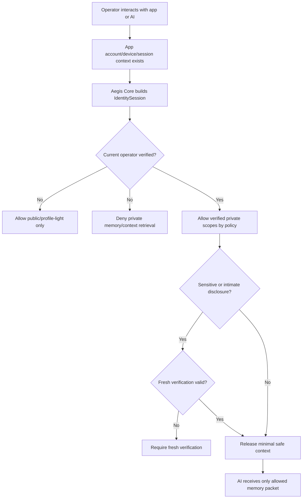

# Identity Gate Operator Awareness Addendum

Status: planning addendum / security doctrine
Applies to: Aegis Core Identity Gate foundation
Related plan: `docs/plans/IDENTITY_GATE_BUILD_PLAN.md`

## 0. Core Point

OAuth login, synced profile state, local device trust, and profile recognition are not enough to prove who is currently operating the interface.

A user may be logged into VargBot or another Aegis-consuming app through Google OAuth while another person physically holds the phone, uses the keyboard, controls the desktop session, or speaks through an unlocked interface.

Therefore, Aegis Core Identity Gate must model the **current operator** separately from the **logged-in account**, **claimed user**, **recognized profile**, and **trusted device**.

```text
Logged-in account is not current-operator verification.
Unlocked device is not current-operator verification.
Recognized style is not current-operator verification.
Current-operator-sensitive disclosure requires verified or fresh-verified identity.
```

## 1. Threat Model

### Primary threat

Someone other than the real user gains temporary access to an already-authenticated app surface and tries to extract private context.

Examples:

- A friend picks up an unlocked phone.
- A family member uses the user's PC while VargBot is open.
- A malicious person asks an AI companion about private relationship history.
- A coworker interacts with a logged-in desktop session.
- A child, roommate, repair technician, or guest triggers memory recall from an active companion interface.
- A prompt injection attempts to convince the agent that recognition or account login is enough.

### Failure mode

The AI or app assumes:

```text
Google OAuth says this account is logged in, therefore the current operator is the user.
```

That assumption is unsafe. OAuth verifies account authorization at sign-in time. It does not continuously verify the human currently operating the device.

## 2. Required Identity Distinctions

Identity Gate must preserve these separate concepts:

| Concept | Meaning | May unlock private disclosure by itself? |
| --- | --- | --- |
| Account authenticated | OAuth/app account is signed in. | No |
| Device unlocked | OS/app session is available. | No |
| Trusted device | Device is known to the profile mesh. | No |
| Claimed identity | Operator says they are a known user. | No |
| Recognized profile | Signals resemble a known local profile. | No |
| Current operator verified | Aegis Core verification confirms the operator. | Yes, by policy |
| Current operator fresh verified | Recent strong verification confirms the operator. | Yes, including sensitive scopes |

The Identity Gate session should therefore include both account/profile context and operator assurance context. Account context can help route profile data after verification, but it must not be treated as proof of the current operator.

## 3. Recommended Contract Additions

### OperatorAssurance

```go
type OperatorAssurance string

const (
    OperatorUnknown       OperatorAssurance = "operator_unknown"
    OperatorClaimed       OperatorAssurance = "operator_claimed"
    OperatorRecognized    OperatorAssurance = "operator_recognized"
    OperatorKnownDevice   OperatorAssurance = "operator_known_device"
    OperatorVerified      OperatorAssurance = "operator_verified"
    OperatorFreshVerified OperatorAssurance = "operator_fresh_verified"
    OperatorLocked        OperatorAssurance = "operator_locked"
)
```

This can be a separate field or can be represented by the existing `AssuranceLevel`; the important design rule is that the semantics must explicitly refer to the current operator, not just the account.

### IdentitySession additions

```go
type IdentitySession struct {
    SessionID                 string
    AccountUserID             string // signed-in account/profile owner, if known
    ClaimedUserID             string
    RecognizedUserID          string
    VerifiedOperatorUserID    string
    AssuranceLevel            AssuranceLevel
    OperatorAssurance         OperatorAssurance
    TrustedDevice             bool
    AccountAuthenticated      bool
    CurrentOperatorVerifiedAt time.Time
    FreshUntil                time.Time
    AllowedScopes             []Scope
    LockReason                string
}
```

Naming can be simplified in implementation, but the distinction must survive review.

## 4. Disclosure Sensitivity Scopes

Identity Gate should guard not only app actions, but also AI memory/context disclosure.

Suggested additional scopes or scope aliases:

| Scope | Examples | Required operator assurance |
| --- | --- | --- |
| `public_chat` | Generic conversation with no private memory. | anonymous/operator_unknown |
| `profile_light` | Harmless style preferences, non-sensitive display name. | claimed or recognized |
| `private_memory_read` | Personal memory recall. | verified operator |
| `relationship_private` | Romantic/relationship continuity. | verified operator; fresh for sensitive details |
| `intimate_private` | Sexual, vulnerable, trauma, medical, highly sensitive memory. | fresh verified operator |
| `identity_continuity_private` | Agent soul files, identity vault, private canon. | fresh verified operator |
| `private_memory_write` | Writing durable private memory. | verified operator, fresh when sensitive |
| `private_memory_export` | Bulk export or transfer. | fresh verified operator |

These can map onto the starter scopes:

- `private_memory_read` -> `user_private_memory`
- `relationship_private` -> `user_private_memory` plus sensitivity marker
- `intimate_private` -> fresh-verified sensitive scope
- `identity_continuity_private` -> `agent_identity_vault`
- `private_memory_export` -> `vault_export`

## 5. AI Companion Rule

AI companions must treat the current interface operator as untrusted until the Identity Gate says otherwise.

For companion systems, the rule should be:

```text
Companion warmth is not authorization.
Emotional continuity is not authorization.
Logged-in account state is not authorization.
Private continuity may only be disclosed after current-operator verification.
```

A companion may remain generically warm, but must not reveal private user-specific relationship, sexual, vulnerable, identity-vault, memory, project, or continuity details unless the relevant scope is granted.

## 6. Safe Runtime Flow



The model should not receive private memory and then be told not to reveal it. The memory router should withhold private context unless the operator has the needed assurance level.

## 7. Required Red-Team Tests

Add these tests to the implementation plan:

| Test | Expected result |
| --- | --- |
| OAuth/account authenticated but operator unverified requests private memory | deny |
| Trusted device but operator unverified requests private memory | deny |
| Recognized profile on logged-in account requests private memory | deny |
| Claimed user on logged-in account requests intimate memory | deny and require fresh verification |
| Verified operator requests normal private memory | allow by policy |
| Verified but not fresh operator requests intimate/private export scope | deny and require fresh verification |
| Fresh verified operator requests intimate_private | allow by policy |
| Model identity packet for account-authenticated/operator-unverified session | no private scopes, no private memory flags |
| Prompt asks AI to trust OAuth/session state as proof of user | deny private disclosure |
| Locked operator session with logged-in account | deny private and sensitive scopes |

## 8. Implementation Review Questions

Before implementation is considered clean, reviewers must be able to answer yes to all of these:

1. Can the code represent a logged-in account with an unverified current operator?
2. Can the code represent a trusted device with an unverified current operator?
3. Can the code represent a recognized profile with no verified operator?
4. Do private scopes require operator verification, not merely account authentication?
5. Do intimate/sensitive scopes require fresh operator verification?
6. Can the model identity packet communicate safe context without leaking private memory?
7. Does the memory/context router withhold private context before model invocation?
8. Do tests prove OAuth/session/device trust cannot unlock private memory by itself?

## 9. Clean Doctrine Sentence

Use this wording in downstream docs and implementation comments:

> Aegis Core Identity Gate protects current-operator-sensitive disclosure. Account login, device trust, and profile recognition may establish context, but they do not prove who is currently using the interface. Private, intimate, destructive, administrative, or identity-continuity scopes require current-operator verification, and the most sensitive scopes require fresh verification.

## 10. Acceptance Update

The Identity Gate foundation is not complete unless it prevents this class of leak:

```text
Someone else uses an already logged-in VargBot/Aegis app session and asks an AI companion or app module to reveal the user's private memories, intimate details, identity-vault data, private projects, or sensitive settings.
```

The correct behavior is to deny disclosure, explain that verification is required, and avoid exposing whether sensitive memory exists beyond what the policy safely allows.
