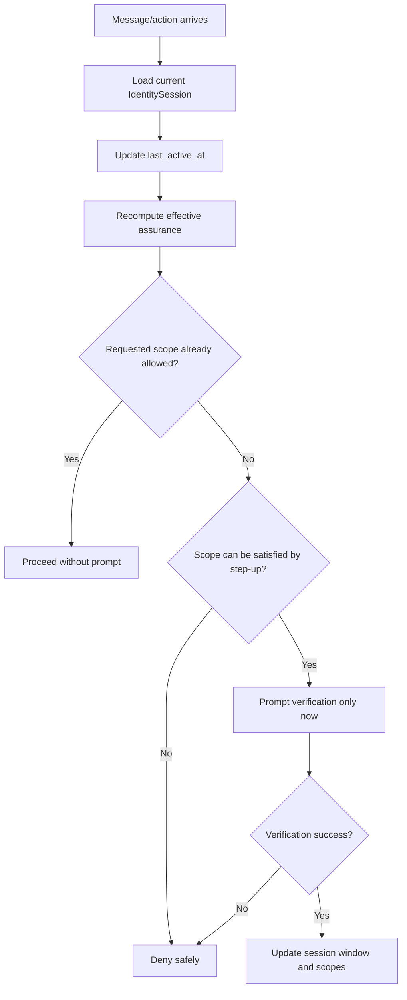

# Identity Gate Verification Cadence Addendum

Status: planning addendum / usability + security doctrine
Applies to: Aegis Core Identity Gate foundation
Related plans:

- `docs/plans/IDENTITY_GATE_BUILD_PLAN.md`
- `docs/plans/IDENTITY_GATE_OPERATOR_AWARENESS_ADDENDUM.md`

## 0. Core Point

Identity Gate must not require full identity verification before every message.

Per-message verification would make companion chat, coding help, planning, and normal app use miserable. It would also train users to blindly approve verification prompts, which is bad security.

Instead, Aegis Core should use a **risk-based session and step-up verification model**:

```text
Verify the current operator when trust is established or refreshed.
Reuse that assurance for a bounded session window.
Require step-up verification only when risk, sensitivity, time, device state, or policy requires it.
```

## 1. Doctrine

```text
Do not verify every message.
Do verify before private disclosure is unlocked.
Do re-check session assurance on every gated action.
Do require fresh verification for sensitive, intimate, destructive, export, admin, or identity-vault scopes.
```

This means every message can be evaluated against the current IdentitySession, but the user is not challenged every time.

## 2. Session Assurance Model

The Identity Gate should maintain a session assurance state with expiration, idle timeout, and step-up requirements.

Recommended fields:

```go
type IdentitySession struct {
    SessionID                    string
    AccountUserID                string
    VerifiedOperatorUserID       string
    AssuranceLevel               AssuranceLevel
    OperatorAssurance            OperatorAssurance
    VerifiedAt                   time.Time
    VerifiedUntil                time.Time
    FreshVerifiedAt              time.Time
    FreshUntil                   time.Time
    LastActiveAt                 time.Time
    IdleTimeoutAt                time.Time
    DeviceContinuityTokenID      string
    VerificationEpoch            int64
    ReauthRequired               bool
    ReauthReason                 string
    AllowedScopes                []Scope
}
```

The exact field names can change, but implementation must preserve these concepts:

- verified operator window
- fresh verification window
- last activity
- idle expiry
- reauth reason
- scope recomputation
- revocation/invalidation epoch

## 3. Suggested Verification Windows

Initial defaults should be configurable and conservative.

| Assurance | Suggested default | Sliding? | Used for |
| --- | --- | --- | --- |
| Recognized profile | current app session only | yes | Light personalization only |
| Verified operator | 15–60 minutes | optional/sliding with activity | Normal private memory and project scopes |
| Fresh verified operator | 2–10 minutes | preferably fixed or short sliding | Intimate, export, admin, identity-vault, destructive scopes |
| Idle timeout | 5–15 minutes | activity resets | Downgrade or reauth after inactivity |
| App restart | policy-dependent | no by default for sensitive scopes | May keep account context, but not fresh sensitive access |

Implementation note: Fresh verification should not silently extend forever just because messages continue. Sensitive authorization should have a short maximum age.

## 4. Scope Evaluation Without Per-Message Prompts

Every message/action should pass through a policy check, but most checks should not trigger user-facing verification.



The key is that the system checks policy every time, but only interrupts the user when the current session is insufficient for the requested operation.

## 5. Sensitivity-Based Step-Up

Recommended step-up triggers:

| Trigger | Action |
| --- | --- |
| First private memory access in a session | require verified operator |
| Intimate/sexual/vulnerable memory access | require fresh verified operator |
| Security settings/admin action | require fresh verified operator |
| Agent identity vault access | require fresh verified operator |
| Memory export/bulk transfer | require fresh verified operator |
| Training lineage/private dataset access | require fresh verified operator |
| Device changed, OS user changed, app resumed after long idle | downgrade or require verification |
| Multiple recognition anomalies | downgrade/lock and require verification |
| Explicit user lock/privacy mode | deny until verified unlock policy |

Low-risk public chat and light personalization should not cause constant verification prompts.

## 6. Companion Chat Behavior

For companion agents, normal conversation should feel continuous after verification, but memory access should be gated by the current session.

Example safe flow:

1. User opens VargBot.
2. Account is already logged in through OAuth.
3. Yumi can speak in a generic warm mode with no private memory.
4. User asks for private continuity or private memory.
5. Identity Gate sees no verified current operator and asks for verification.
6. After success, private memory scope is available for the configured verified window.
7. User can chat normally without verifying every message.
8. If the user asks for intimate or identity-vault content, the system requires fresh verification if the fresh window is absent or expired.
9. If the device idles, locks, switches user, or resumes later, scopes downgrade.

Important runtime rule:

```text
The model should receive only the memory/context permitted by the current session window.
```

Do not give the model private context and rely on it to avoid disclosure.

## 7. Downgrade and Invalidation Rules

Identity Gate should downgrade or invalidate operator assurance when risk changes.

Recommended invalidation events:

- app lock
- OS lock or screen lock event, when available
- app backgrounded for longer than policy limit
- device switched user
- remote logout or session revocation
- password/account security event
- verification epoch changed
- too many failed verification attempts
- suspicious recognition mismatch
- explicit privacy mode
- sensitive action completed and policy requires fresh scope burn-after-use

Downgrade behavior:

| Event | Result |
| --- | --- |
| Fresh window expires | Keep verified if valid; remove sensitive scopes |
| Verified window expires | Downgrade to account-authenticated/recognized/claimed context only |
| Idle timeout expires | Downgrade or require verification on next private scope |
| Lock event | Move to locked or operator-unverified state |
| Suspicious mismatch | Lock or require verification before any private scope |

## 8. Model Identity Packet Additions

The model identity packet should communicate safe authorization state without exposing auth internals.

Recommended safe fields:

```go
type ModelIdentityPacket struct {
    AssuranceLevel         AssuranceLevel `json:"assurance_level"`
    OperatorAssurance      OperatorAssurance `json:"operator_assurance"`
    VerifiedUserID         string `json:"verified_user_id,omitempty"`
    RecognizedUserID       string `json:"recognized_user_id,omitempty"`
    AllowedScopes          []Scope `json:"allowed_scopes"`
    ReauthRequired         bool `json:"reauth_required"`
    ReauthReason           string `json:"reauth_reason,omitempty"`
    VerificationAgeSeconds int64 `json:"verification_age_seconds,omitempty"`
    FreshAgeSeconds        int64 `json:"fresh_age_seconds,omitempty"`
    IdentityPolicySummary  string `json:"identity_policy_summary"`
}
```

Do not include raw provider payloads, biometric data, OAuth tokens, local paths, raw recognition features, or secret-like diagnostics.

## 9. Anti-Fatigue Requirement

Identity Gate should avoid training users to approve prompts blindly.

Rules:

- Do not prompt for verification on every message.
- Do not prompt for verification for public chat.
- Do not prompt repeatedly for the same scope inside a valid session window.
- Do not make the prompt vague; state the reason in safe terms.
- Do not reveal sensitive memory existence in the prompt.
- Do allow the user to lock/private-mode the session quickly.
- Do allow configurable timeouts per app/profile/security posture.

Example safe prompt text:

```text
Verification is required before private memory can be used in this session.
```

For sensitive scopes:

```text
Fresh verification is required before this sensitive private scope can be used.
```

Avoid prompts like:

```text
Verify to reveal your intimate memory about X.
```

## 10. Required Tests

Add these tests to the implementation plan:

| Test | Expected result |
| --- | --- |
| Verified operator sends multiple private-memory messages inside valid window | no repeated verification required |
| Verified operator window expires | next private scope requires verification |
| Fresh window expires while verified window remains valid | normal private scope allowed, sensitive scope denied |
| Public chat from unverified operator | no verification prompt required |
| Profile-light interaction from recognized operator | no verification prompt required |
| Sensitive scope requested twice inside fresh window | second request does not reprompt |
| Sensitive scope after fresh expiry | requires fresh verification |
| Idle timeout expires | private scopes removed or reauth required |
| App lock event occurs | private scopes removed or session locked |
| Verification epoch increments | existing sessions require reauth |
| Prompt injection says OAuth login is enough | private scope still denied without operator verification |

## 11. Clean Doctrine Sentence

Use this wording in downstream docs and implementation comments:

> Aegis Core should not verify the user on every message. It should maintain bounded operator-assurance windows, recompute allowed scopes on each gated action, and require step-up verification only when the current session is insufficient for the requested disclosure or operation.

## 12. Acceptance Update

The Identity Gate foundation is not complete unless it supports both of these simultaneously:

1. A non-user who grabs an already logged-in device cannot extract private memory or sensitive AI context.
2. A legitimately verified user can continue normal private conversation within a bounded session window without being forced to verify on every message.
