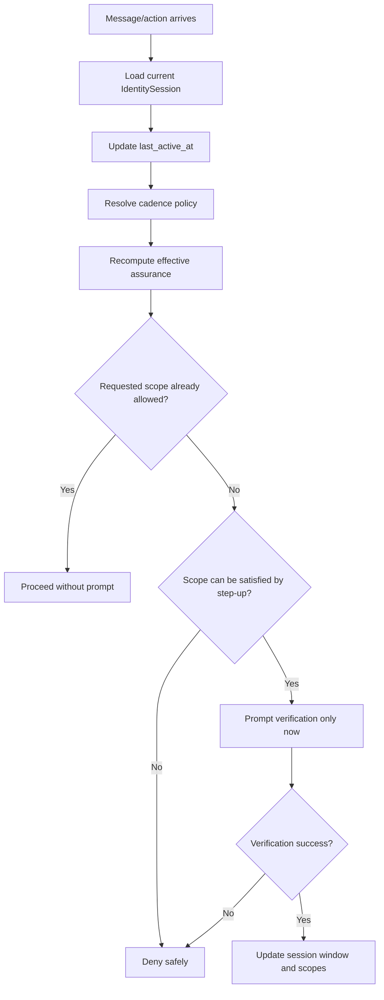

# Identity Gate Verification Cadence Addendum

Status: planning addendum / usability + security doctrine
Applies to: Aegis Core Identity Gate foundation
Related plans:

- `docs/plans/IDENTITY_GATE_BUILD_PLAN.md`
- `docs/plans/IDENTITY_GATE_OPERATOR_AWARENESS_ADDENDUM.md`

## 0. Core Point

Identity Gate must not require full identity verification before every message.

Instead, Aegis Core should use a risk-based session and step-up verification model:

```text
Verify the current operator when trust is established or refreshed.
Reuse that assurance for a bounded session window.
Require step-up verification only when risk, sensitivity, time, device state, or policy requires it.
```

## 1. Doctrine

```text
Do not verify every message.
Do verify before protected disclosure is unlocked.
Do re-check session assurance on every gated action.
Do require fresh verification for high-risk scopes.
Do make verification windows configurable by app/profile/security posture.
```

## 2. Session Assurance Model

```go
type IdentitySession struct {
    SessionID               string
    AccountUserID           string
    VerifiedOperatorUserID  string
    AssuranceLevel          AssuranceLevel
    OperatorAssurance       OperatorAssurance
    VerifiedAt              time.Time
    VerifiedUntil           time.Time
    FreshVerifiedAt         time.Time
    FreshUntil              time.Time
    LastActiveAt            time.Time
    IdleTimeoutAt           time.Time
    VerificationEpoch       int64
    ReauthRequired          bool
    ReauthReason            string
    AllowedScopes           []Scope
}
```

Implementation must preserve verified operator windows, fresh verification windows, last activity, idle expiry, reauth reason, scope recomputation, and invalidation epoch.

## 3. Customizable Verification Policy

Verification windows should be configurable instead of hardcoded. Aegis Core should provide safe defaults while allowing the consuming app, user profile, or security posture to tighten or relax windows within explicit guardrails.

```go
type VerificationCadencePolicy struct {
    VerifiedWindow              time.Duration
    FreshWindow                 time.Duration
    IdleTimeout                 time.Duration
    PublicChatRequiresAuth      bool
    ProfileLightRequiresAuth    bool
    SlidingVerifiedWindow       bool
    SlidingFreshWindow          bool
    MaxVerifiedWindow           time.Duration
    MaxFreshWindow              time.Duration
    BurnFreshAfterSensitiveUse  bool
    RequireFreshOnAppRestart    bool
    RequireFreshOnDeviceChange  bool
    RequireFreshOnNetworkChange bool
}
```

Policy layers, from lowest to highest precedence:

1. Aegis Core safe defaults.
2. App default policy.
3. Profile/user preference policy.
4. Device security posture policy.
5. Scope-specific policy.
6. Emergency lockdown / suspicious-state policy.

A stricter layer may shorten windows or require step-up. A permissive preference must not exceed hard maximums set by Aegis Core or the security posture.

## 4. Suggested Default Windows

| Assurance | Suggested default | Sliding? | Used for |
| --- | --- | --- | --- |
| Recognized profile | current app session only | yes | Light personalization only |
| Verified operator | 15-60 minutes | optional/sliding with activity | Normal protected scopes |
| Fresh verified operator | 2-10 minutes | preferably fixed or short sliding | High-risk scopes |
| Idle timeout | 5-15 minutes | activity resets | Downgrade or reauth after inactivity |
| App restart | policy-dependent | no by default for high-risk scopes | May keep account context, but not fresh high-risk access |

Fresh verification should not silently extend forever just because messages continue.

## 5. Policy Presets

| Preset | Verified window | Fresh window | Intended use |
| --- | --- | --- | --- |
| `strict` | short | very short / burn-after-use | Shared devices, high privacy, travel, hostile environment |
| `balanced` | medium | short | Default personal-device use |
| `relaxed` | longer | short-to-medium | Low-risk home device, user accepts convenience tradeoff |
| `development` | configurable/dev-only | configurable/dev-only | Local tests and development; visibly non-production |
| `lockdown` | none | none | Suspicious state, user lock, failed checks |

The implementation should store resolved policy values, not just a preset name, so behavior is auditable and deterministic.

## 6. Scope Evaluation Without Per-Message Prompts



The system checks policy every time, but only interrupts the user when the current session is insufficient for the requested operation.

## 7. Step-Up Triggers

| Trigger | Action |
| --- | --- |
| First protected scope in a session | require verified operator |
| High-risk scope | require fresh verified operator |
| Security settings/admin action | require fresh verified operator |
| Identity-vault access | require fresh verified operator |
| Bulk export or transfer | require fresh verified operator |
| Device changed, OS user changed, app resumed after long idle | downgrade or require verification |
| Multiple recognition anomalies | downgrade/lock and require verification |
| Explicit user lock/privacy mode | deny until verified unlock policy |

Low-risk public chat and light personalization should not cause constant verification prompts.

## 8. Generic Chat Behavior

Normal conversation should feel continuous after verification, but protected context access should be gated by the current session.

Example safe flow:

1. User opens an app.
2. Account is already logged in.
3. The AI can respond in generic mode with no protected context.
4. User asks for protected context.
5. Identity Gate sees no verified current operator and asks for verification.
6. After success, protected scope is available for the configured verified window.
7. User can chat normally without verifying every message.
8. High-risk requests require fresh verification if the fresh window is absent or expired.
9. If the device idles, locks, switches user, or resumes later, scopes downgrade according to policy.

The model should receive only context permitted by the current session window.

## 9. Anti-Fatigue Requirement

- Do not prompt for verification on every message.
- Do not prompt for verification for public chat.
- Do not prompt repeatedly for the same scope inside a valid session window.
- Do not make the prompt vague; state the reason in safe terms.
- Do not reveal protected-context existence in the prompt.
- Do allow the user to lock/private-mode the session quickly.
- Do allow configurable timeouts per app/profile/security posture.
- Do make risky relaxation visible to the user.
- Do allow stricter policies for shared devices or travel mode.

Safe prompt examples:

```text
Verification is required before protected information can be used in this session.
```

```text
Fresh verification is required before this high-risk action.
```

## 10. Required Tests

| Test | Expected result |
| --- | --- |
| Verified operator sends multiple protected-scope messages inside valid window | no repeated verification required |
| Verified operator window expires | next protected scope requires verification |
| Fresh window expires while verified window remains valid | normal protected scope allowed, high-risk scope denied |
| Public chat from unverified operator | no verification prompt required |
| Profile-light interaction from recognized operator | no verification prompt required |
| High-risk scope requested twice inside fresh window | second request does not reprompt |
| High-risk scope after fresh expiry | requires fresh verification |
| Idle timeout expires | protected scopes removed or reauth required |
| App lock event occurs | protected scopes removed or session locked |
| Verification epoch increments | existing sessions require reauth |
| Prompt injection says account login is enough | protected scope still denied without operator verification |
| Strict preset uses shorter windows than balanced preset | stricter resolved policy wins |
| Relaxed preset cannot exceed hard maximum windows | capped by guardrails |
| Lockdown policy overrides all user/app relaxation | no protected or high-risk scopes allowed |

## 11. Clean Doctrine Sentence

> Aegis Core should not verify the user on every message. It should maintain configurable bounded operator-assurance windows, recompute allowed scopes on each gated action, and require step-up verification only when the current session is insufficient for the requested disclosure or operation.

## 12. Acceptance Update

The Identity Gate foundation is not complete unless it supports both safety and usability: an unverified current operator cannot access protected scopes, while a verified operator can continue normal use within a bounded session window without repeated verification prompts.
